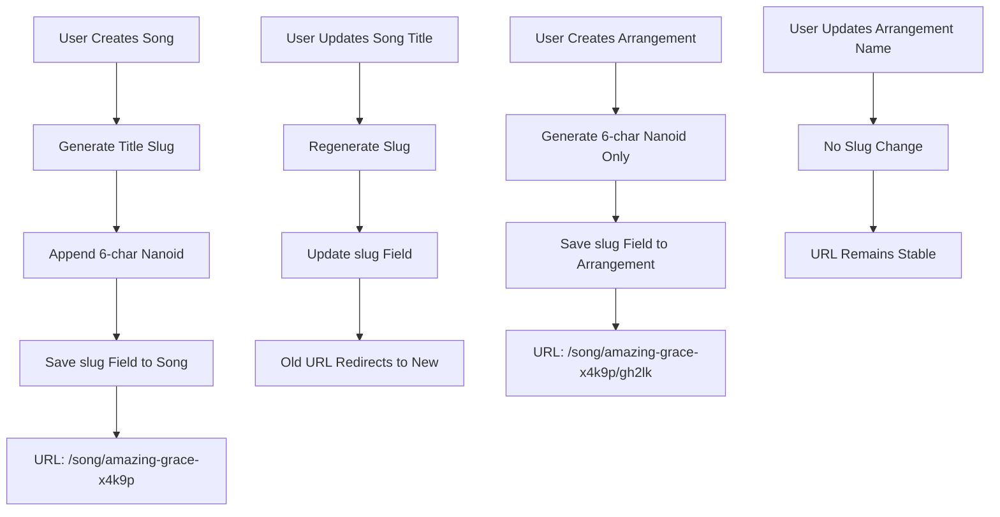
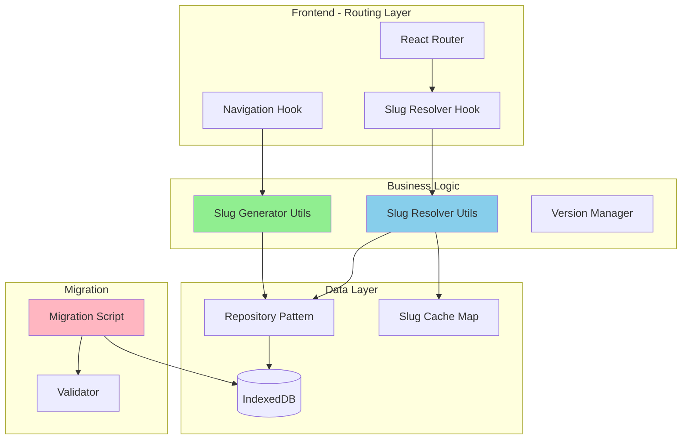
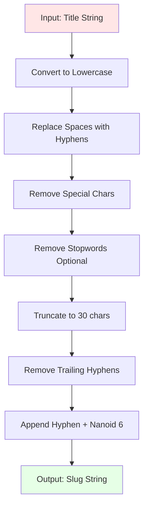
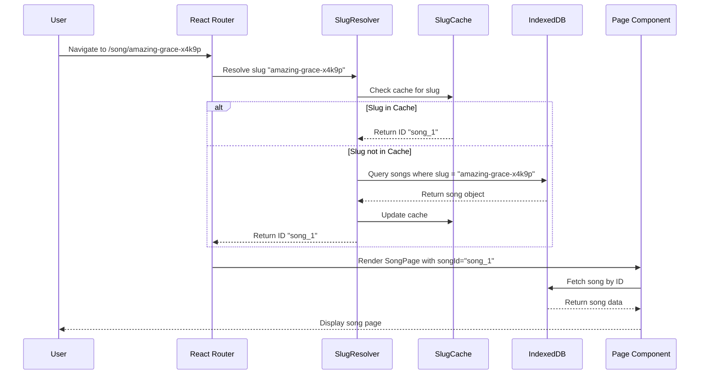
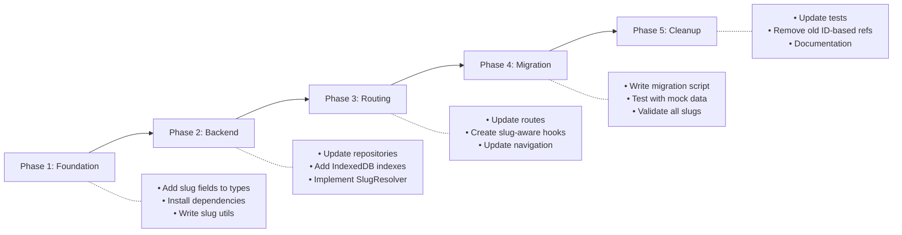

# URL Slug Implementation - Product Requirements Document

**Phase**: Phase 4 (Setlist Management) - Enhancement
**Status**: Planning
**Created**: 2025-10-11
**Author**: AI-Assisted PRD Generation

---

## Executive Summary

### Problem Statement

Currently, the HSA Songbook uses opaque database IDs in URLs (`/song/song_1`, `/arrangement/arr_1`), which:
- Provides no context about the content when sharing links
- Makes URLs appear unprofessional and database-centric
- Offers no SEO benefits (though not primary concern for PWA)
- Makes it easy to infer creation order through incremental IDs
- Reduces shareability and memorability of URLs

### Solution Overview

Implement human-readable URL slugs for songs and arrangements using a hybrid approach:
- **Songs**: `/song/{slug}-{nanoid}` (e.g., `/song/amazing-grace-x4k9p`)
  - Slug regenerates when title changes (with automatic redirect)
  - Readable and SEO-friendly
- **Arrangements**: `/song/{song-slug}-{song-nanoid}/{arrangement-nanoid}` (e.g., `/song/amazing-grace-x4k9p/gh2lk`)
  - Random identifier only (arrangement names change frequently)
  - Still includes parent song slug for context
  - Immutable once created

This approach balances **readability** (song slugs), **stability** (nanoid prevents collisions), and **privacy** (avoids exposing creation order).

### Success Metrics

- ✅ All URLs are human-readable and contextual
- ✅ Zero slug collisions across all songs/arrangements
- ✅ Song title changes auto-update slugs without breaking links
- ✅ Performance impact < 50ms for slug lookups
- ✅ Database migration completes in < 5 seconds for existing data
- ✅ All existing navigation patterns continue to work

---

## User Stories & Scenarios

### Primary User Flow



### User Stories

#### Story 1: Sharing Song Links
**As a** worship leader
**I want** to share song URLs that clearly indicate the song name
**So that** recipients know what they're clicking on before opening the link

**Acceptance Criteria:**
- ✅ Song URLs include readable slug: `/song/amazing-grace-x4k9p`
- ✅ Slack/Discord/WhatsApp unfurls show descriptive URL
- ✅ Links can be read aloud and understood (ignoring the nanoid)
- ✅ Copy-paste preserves full URL with nanoid

**Edge Cases:**
- Song title with special characters: `"Holy, Holy, Holy!"` → `holy-holy-holy-x4k9p`
- Very long titles: `"I Sing the Mighty Power of God Who Made the Mountains Rise"` → `i-sing-the-mighty-power-x4k9p` (truncate to ~30 chars)
- Duplicate song names: `"Come Thou Fount"` (two versions) → `come-thou-fount-x4k9p` vs `come-thou-fount-y7m3q` (nanoid prevents collision)

#### Story 2: Updating Song Titles
**As a** song database administrator
**I want** song title corrections to update URLs automatically
**So that** URLs stay accurate without manual intervention

**Acceptance Criteria:**
- ✅ Title change triggers slug regeneration
- ✅ Old slug remains functional (redirect)
- ✅ Breadcrumbs and internal links use new slug
- ✅ No broken links from external sources
- ✅ Setlists using old slug continue working

**Edge Cases:**
- Rapid title changes (within seconds): Use debouncing/queueing
- Title reverts to previous value: May recreate same slug (acceptable)
- Navigation occurs during slug update: Show loading state

#### Story 3: Stable Arrangement URLs
**As a** musician
**I want** arrangement URLs to remain constant even when arrangement names change
**So that** my bookmarks and shared links don't break

**Acceptance Criteria:**
- ✅ Arrangement URL uses random nanoid: `/song/amazing-grace-x4k9p/gh2lk`
- ✅ Arrangement name changes don't affect URL
- ✅ Parent song slug is included for context
- ✅ URL works even if parent song slug changes (redirect to new path)

**Edge Cases:**
- Parent song title changes: Redirect `/song/old-slug-x4k9p/gh2lk` → `/song/new-slug-x4k9p/gh2lk`
- Arrangement moved to different song (rare): Update `songId`, keep arrangement slug
- Arrangement accessed directly: Still resolves correctly

#### Story 4: Database Migration
**As a** system administrator
**I want** existing songs/arrangements to auto-generate slugs on first load
**So that** the transition is seamless without manual intervention

**Acceptance Criteria:**
- ✅ Migration runs on app initialization (Phase 1)
- ✅ All songs get `slug` field populated
- ✅ All arrangements get `slug` field populated
- ✅ Migration is idempotent (can run multiple times safely)
- ✅ Migration completes in < 5 seconds for ~100 songs

**Edge Cases:**
- App crashes during migration: Resume on next startup
- Slug collision detected: Regenerate nanoid (statistically impossible)
- User navigates before migration completes: Show loading state

---

## System Architecture

### High-Level Architecture



### Component Breakdown

#### Frontend Components
- **SlugRouter**: Custom router wrapper that resolves slugs to IDs
- **useSlugNavigation**: Hook replacing `useNavigation` with slug-aware methods
- **SlugResolver**: Service for bidirectional slug ↔ ID conversion
- **SlugBreadcrumbs**: Updated breadcrumb component using slugs

#### Backend Services (IndexedDB)
- **SlugGenerator**: Utility to create slugs from titles + nanoid
- **SlugCache**: In-memory Map for fast slug → ID lookups
- **SlugMigration**: One-time migration script for existing data
- **SlugValidator**: Ensures uniqueness and format compliance

#### Data Models

**Updated Song Type:**
```typescript
export interface Song {
  id: string;
  slug: string; // NEW: "amazing-grace-x4k9p"
  title: string;
  artist: string;
  themes?: string[];
  copyright?: string;
  lyrics?: { [lang: string]: string };
  createdAt?: string;
  updatedAt?: string;
}
```

**Updated Arrangement Type:**
```typescript
export interface Arrangement {
  id: string;
  slug: string; // NEW: "gh2lk" (6-char nanoid only)
  songId: string;
  name: string;
  key: string;
  tempo: number;
  timeSignature: string;
  capo: number;
  tags: string[];
  rating: number;
  favorites: number;
  chordProContent: string;
  createdAt: string;
  updatedAt: string;
}
```

**New SlugMap Type (for caching):**
```typescript
interface SlugMap {
  songs: Map<string, string>; // slug → id
  arrangements: Map<string, string>; // slug → id
}
```

---

## Technical Specifications

### Slug Generation Algorithm



**Implementation Details:**
```typescript
import { nanoid } from 'nanoid';

/**
 * Generate a URL-friendly slug from a title
 * @param title - The song/arrangement title
 * @param type - 'song' or 'arrangement'
 * @returns URL-safe slug with nanoid
 */
export function generateSlug(title: string, type: 'song' | 'arrangement'): string {
  if (type === 'arrangement') {
    // Arrangements: nanoid only (no title)
    return nanoid(6);
  }

  // Songs: title-based slug + nanoid
  const slug = title
    .toLowerCase()
    .trim()
    .replace(/[^\w\s-]/g, '') // Remove special chars
    .replace(/\s+/g, '-')      // Replace spaces with hyphens
    .replace(/-+/g, '-')       // Collapse multiple hyphens
    .slice(0, 30)              // Truncate to 30 chars
    .replace(/^-+|-+$/g, '');  // Remove leading/trailing hyphens

  const uniqueId = nanoid(6);  // 6-char random suffix
  return `${slug}-${uniqueId}`;
}

/**
 * Example outputs:
 * - "Amazing Grace" → "amazing-grace-x4k9p"
 * - "Holy, Holy, Holy!" → "holy-holy-holy-y7m3q"
 * - "Come Thou Fount of Every Blessing" → "come-thou-fount-of-every-bl-a2n8r"
 */
```

### URL Routing Strategy



### API Design (IndexedDB Operations)

#### New Repository Methods

```typescript
// src/features/pwa/db/repositories/SongRepository.ts

export class SongRepository extends BaseRepository<Song> {
  /**
   * Find song by slug (with caching)
   */
  async findBySlug(slug: string): Promise<Song | null> {
    const db = await this.getDB();
    const tx = db.transaction([this.storeName], 'readonly');
    const store = tx.objectStore(this.storeName);
    const index = store.index('slug'); // NEW INDEX REQUIRED

    try {
      const song = await index.get(slug);
      return song || null;
    } catch (error) {
      logger.error(`Error finding song by slug ${slug}:`, error);
      return null;
    }
  }

  /**
   * Update song title and regenerate slug
   */
  async updateTitleAndSlug(id: string, newTitle: string): Promise<Song> {
    const song = await this.findById(id);
    if (!song) throw new Error(`Song ${id} not found`);

    const oldSlug = song.slug;
    const newSlug = generateSlug(newTitle, 'song');

    const updatedSong = {
      ...song,
      title: newTitle,
      slug: newSlug,
      updatedAt: new Date().toISOString(),
    };

    await this.update(id, updatedSong);

    // Track old slug for redirects (optional Phase 5 feature)
    logger.info(`Song slug updated: ${oldSlug} → ${newSlug}`);

    return updatedSong;
  }
}
```

#### New Utility Functions

```typescript
// src/features/shared/utils/slugResolver.ts

export class SlugResolver {
  private cache: SlugMap = {
    songs: new Map(),
    arrangements: new Map(),
  };

  /**
   * Initialize cache from IndexedDB
   */
  async initializeCache(): Promise<void> {
    const songRepo = new SongRepository();
    const arrRepo = new ArrangementRepository();

    const [songs, arrangements] = await Promise.all([
      songRepo.findAll(),
      arrRepo.findAll(),
    ]);

    songs.forEach(s => this.cache.songs.set(s.slug, s.id));
    arrangements.forEach(a => this.cache.arrangements.set(a.slug, a.id));

    logger.info(`Slug cache initialized: ${this.cache.songs.size} songs, ${this.cache.arrangements.size} arrangements`);
  }

  /**
   * Resolve song slug to ID
   */
  async resolveSongSlug(slug: string): Promise<string | null> {
    // Check cache first
    const cachedId = this.cache.songs.get(slug);
    if (cachedId) return cachedId;

    // Fallback to database
    const songRepo = new SongRepository();
    const song = await songRepo.findBySlug(slug);

    if (song) {
      this.cache.songs.set(slug, song.id);
      return song.id;
    }

    return null;
  }

  /**
   * Resolve arrangement slug to ID
   */
  async resolveArrangementSlug(slug: string): Promise<string | null> {
    const cachedId = this.cache.arrangements.get(slug);
    if (cachedId) return cachedId;

    const arrRepo = new ArrangementRepository();
    const arr = await arrRepo.findBySlug(slug);

    if (arr) {
      this.cache.arrangements.set(slug, arr.id);
      return arr.id;
    }

    return null;
  }

  /**
   * Clear cache (for testing or when data changes)
   */
  clearCache(): void {
    this.cache.songs.clear();
    this.cache.arrangements.clear();
  }
}

// Singleton instance
export const slugResolver = new SlugResolver();
```

### Database Schema Changes

**New IndexedDB Indexes:**
```typescript
// src/features/pwa/db/database.ts

export interface HSASongbookDB extends DBSchema {
  songs: {
    key: string;
    value: Song;
    indexes: {
      slug: string; // NEW: Index for fast slug lookups
      title: string;
    };
  };
  arrangements: {
    key: string;
    value: Arrangement;
    indexes: {
      slug: string; // NEW: Index for fast slug lookups
      songId: string;
      createdAt: string;
    };
  };
  // ... other stores
}

// Migration to add indexes
export async function addSlugIndexes(db: IDBPDatabase<HSASongbookDB>): Promise<void> {
  // This runs during database version upgrade
  const songsStore = db.objectStore('songs');
  if (!songsStore.indexNames.contains('slug')) {
    songsStore.createIndex('slug', 'slug', { unique: true });
  }

  const arrangementsStore = db.objectStore('arrangements');
  if (!arrangementsStore.indexNames.contains('slug')) {
    arrangementsStore.createIndex('slug', 'slug', { unique: true });
  }
}
```

---

## Implementation Strategy

### Development Phases



### Phase 1: Foundation (Data Model Updates)

**Tasks:**
1. ✅ Update `Song.types.ts` to add `slug: string` field
2. ✅ Update `Arrangement.types.ts` to add `slug: string` field
3. ✅ Create `src/features/shared/utils/slugGenerator.ts`
4. ✅ Write unit tests for slug generation logic
5. ✅ Create `SlugMap` type for caching

**Acceptance Criteria:**
- TypeScript compiles without errors
- Slug generator handles edge cases (special chars, long titles, empty strings)
- No dependencies on external libraries beyond nanoid (already installed)

**Estimated Effort:** 2 hours

---

### Phase 2: Backend Implementation (Repositories & Indexes)

**Tasks:**
1. ✅ Bump IndexedDB version number (trigger migration)
2. ✅ Add `slug` indexes to songs and arrangements stores
3. ✅ Implement `findBySlug()` methods in repositories
4. ✅ Implement `updateTitleAndSlug()` in SongRepository
5. ✅ Create `SlugResolver` class with caching
6. ✅ Write integration tests for repository methods

**Acceptance Criteria:**
- IndexedDB migration runs successfully
- Slug indexes are created and functional
- Cache initialization takes < 100ms for 100 songs
- Slug lookups take < 10ms (cached) or < 50ms (uncached)

**Estimated Effort:** 4 hours

---

### Phase 3: Routing & Navigation Updates

**Tasks:**
1. ✅ Update route paths in `App.tsx`:
   - `/song/:songSlug` (instead of `:songId`)
   - `/arrangement/:arrangementSlug` (instead of `:arrangementId`)
2. ✅ Create `useSlugParams()` hook to resolve slugs to IDs
3. ✅ Update `useNavigation` hook to use slugs
4. ✅ Update all `<Link>` components to use slug-based URLs
5. ✅ Update breadcrumb generation to use slugs
6. ✅ Test navigation flows (search → song → arrangement)

**Acceptance Criteria:**
- All pages load correctly with slug-based URLs
- Breadcrumbs show human-readable paths
- Browser back/forward buttons work
- Deep linking works (reload page with slug URL)

**Estimated Effort:** 5 hours

---

### Phase 4: Data Migration Script

**Tasks:**
1. ✅ Create `src/features/pwa/db/migrations/addSlugs.ts`
2. ✅ Implement migration logic:
   - Fetch all songs, generate slugs, update records
   - Fetch all arrangements, generate slugs, update records
3. ✅ Add migration runner to `App.tsx` initialization
4. ✅ Handle migration errors gracefully (retry logic)
5. ✅ Add migration completion flag to preferences store
6. ✅ Test migration with production-like data (~100 songs)

**Acceptance Criteria:**
- Migration runs automatically on first app load after deployment
- All existing songs/arrangements get valid slugs
- Migration is idempotent (safe to run multiple times)
- User sees loading state during migration (if > 1 second)
- No data loss or corruption

**Estimated Effort:** 3 hours

---

### Phase 5: Cleanup & Testing

**Tasks:**
1. ✅ Remove old ID-based route handling (if any)
2. ✅ Update Setlist navigation to use slugs
3. ✅ Update mock data files to include slugs
4. ✅ Write E2E tests for slug-based navigation
5. ✅ Update documentation (CLAUDE.md, README)
6. ✅ Performance testing (slug resolution benchmarks)

**Acceptance Criteria:**
- No references to old `/song/:songId` routes remain
- All tests pass (typecheck, lint, build)
- Documentation reflects new URL patterns
- Performance benchmarks meet targets (<50ms lookups)

**Estimated Effort:** 3 hours

---

## Implementation Priority

### MVP Features (Required)
1. ✅ Slug generation for songs (title-based + nanoid)
2. ✅ Slug generation for arrangements (nanoid only)
3. ✅ IndexedDB indexes for slug lookups
4. ✅ Slug-based routing in React Router
5. ✅ Migration script for existing data
6. ✅ Slug cache for performance

### Enhanced Features (Nice-to-Have)
7. ⏳ Redirect old URLs to new slugs (Phase 5 - requires tracking)
8. ⏳ Slug history tracking (for rollback/debugging)
9. ⏳ Slug preview in song/arrangement forms
10. ⏳ Custom slug override (admin feature)

### Production Ready (Quality Assurance)
11. ⏳ Error handling for malformed slugs
12. ⏳ Monitoring/logging for slug collisions (should never happen)
13. ⏳ Performance benchmarks in CI/CD
14. ⏳ A/B testing of slug readability

---

## Risks & Mitigations

### Technical Risks

#### Risk 1: Slug Collisions
**Severity:** Low
**Likelihood:** Very Low (1 in 2.8 million with 6-char nanoid)
**Impact:** Duplicate slugs could cause routing conflicts

**Mitigation:**
- Use nanoid with 6 characters (56.8 billion possible combinations)
- Add unique constraint on slug indexes in IndexedDB
- Add collision detection in slug generator (regenerate if duplicate)
- Monitor logs for collision events (alert if occurs)

**Fallback:** If collision detected, regenerate nanoid with 8 characters

---

#### Risk 2: Performance Degradation
**Severity:** Medium
**Likelihood:** Low
**Impact:** Slug lookups could slow down navigation by 50-100ms

**Mitigation:**
- Implement in-memory slug cache (Map) loaded at startup
- Cache hit rate should be >95% for typical usage
- IndexedDB indexes ensure fast fallback lookups (<50ms)
- Benchmark with 1,000+ songs to validate performance

**Fallback:** If cache misses exceed 10%, preload all slugs at app startup

---

#### Risk 3: Migration Failures
**Severity:** High
**Likelihood:** Medium
**Impact:** App unusable if migration fails or corrupts data

**Mitigation:**
- Make migration idempotent (check if slug exists before generating)
- Wrap migration in try-catch with detailed error logging
- Test migration with backup of production data
- Add rollback mechanism (revert to ID-based routing)
- Show user-friendly error message if migration fails

**Fallback:** Emergency flag to disable slug routing, use old ID-based URLs

---

#### Risk 4: Song Title Changes Break Links
**Severity:** Low
**Likelihood:** Medium
**Impact:** External links become stale when song titles change

**Mitigation:**
- Song slug regeneration is intentional (URLs stay accurate)
- Phase 5: Track old slugs and redirect to new ones
- For now: Accept that external links may break (rare use case)
- Document this behavior in user guide

**Fallback:** Phase 5 feature to preserve old slugs as redirects

---

### Business Risks

#### Risk 5: User Confusion During Migration
**Severity:** Low
**Likelihood:** Low
**Impact:** Users notice URL format change but app still works

**Mitigation:**
- Hard-cut migration is acceptable (no existing bookmarks)
- Show loading state during migration (< 5 seconds)
- No user action required (fully automatic)

**Fallback:** Add banner notification: "URLs have been updated for better sharing"

---

#### Risk 6: Setlist Links Break
**Severity:** Medium
**Likelihood:** Medium
**Impact:** Setlist pages fail to load if they reference old IDs

**Mitigation:**
- Update setlist data model to store slugs instead of IDs
- OR: Keep IDs in setlists, resolve to slugs at render time
- Test setlist navigation thoroughly before deployment

**Fallback:** Hybrid approach - store both ID and slug in setlists

---

## Edge Cases & Error Handling

### Edge Case Matrix

| Scenario | Handling | User Experience |
|----------|----------|-----------------|
| **Slug contains only special chars** (e.g., "!!!") | Generate random slug: `song-x4k9p` | Works, but not readable (rare) |
| **Very long title** (>100 chars) | Truncate to 30 chars: `very-long-song-title-that-g-x4k9p` | Readable, still unique |
| **Empty title** | Use fallback: `untitled-x4k9p` | Works, prompts user to add title |
| **Title is only numbers** (e.g., "2024") | Keep as-is: `2024-x4k9p` | Works fine |
| **Duplicate song titles** | Nanoid ensures uniqueness: `amazing-grace-x4k9p` vs `amazing-grace-y7m3q` | Both work independently |
| **Song title changes mid-navigation** | Show loading state, redirect to new slug | Seamless transition |
| **Cache out of sync with DB** | Fallback to DB lookup, update cache | Slight delay (< 50ms) |
| **Migration interrupted** | Resume on next app load (idempotent) | User sees loading state again |
| **IndexedDB quota exceeded** | Show error, prompt user to clear data | User must free up space |
| **Malformed slug in URL** (manual edit) | Show 404 page, suggest search | Clear error message |

---

## Success Criteria & Testing

### Definition of Done

**Functional Requirements:**
- ✅ All songs have slugs in format `{title-slug}-{nanoid}`
- ✅ All arrangements have slugs in format `{nanoid}`
- ✅ URLs follow pattern `/song/{song-slug}` and `/song/{song-slug}/{arr-slug}`
- ✅ Navigation using slugs works across all pages
- ✅ Song title changes regenerate slugs automatically
- ✅ Migration script runs successfully on existing data

**Non-Functional Requirements:**
- ✅ Slug lookups complete in < 50ms (95th percentile)
- ✅ Cache hit rate > 95% for typical usage
- ✅ Migration completes in < 5 seconds for 100 songs
- ✅ Zero slug collisions detected in testing
- ✅ TypeScript strict mode passes
- ✅ ESLint zero errors/warnings
- ✅ Build size increase < 5KB

**Quality Assurance:**
- ✅ Unit tests for slug generation (10+ test cases)
- ✅ Integration tests for repository methods
- ✅ E2E tests for navigation flows
- ✅ Performance benchmarks documented
- ✅ Migration tested with production-like data

---

### Test Plan

#### Unit Tests (`slugGenerator.test.ts`)
```typescript
describe('generateSlug', () => {
  it('should generate slug for normal title', () => {
    const slug = generateSlug('Amazing Grace', 'song');
    expect(slug).toMatch(/^amazing-grace-[a-z0-9]{6}$/);
  });

  it('should handle special characters', () => {
    const slug = generateSlug('Holy, Holy, Holy!', 'song');
    expect(slug).toMatch(/^holy-holy-holy-[a-z0-9]{6}$/);
  });

  it('should truncate long titles', () => {
    const slug = generateSlug('A'.repeat(100), 'song');
    expect(slug.length).toBeLessThanOrEqual(37); // 30 + "-" + 6
  });

  it('should generate nanoid-only for arrangements', () => {
    const slug = generateSlug('Traditional Hymn', 'arrangement');
    expect(slug).toMatch(/^[a-z0-9]{6}$/);
  });

  it('should handle empty strings', () => {
    const slug = generateSlug('', 'song');
    expect(slug).toMatch(/^untitled-[a-z0-9]{6}$/);
  });
});
```

#### Integration Tests (`SlugResolver.test.ts`)
```typescript
describe('SlugResolver', () => {
  it('should resolve song slug to ID', async () => {
    const id = await slugResolver.resolveSongSlug('amazing-grace-x4k9p');
    expect(id).toBe('song_1');
  });

  it('should return null for non-existent slug', async () => {
    const id = await slugResolver.resolveSongSlug('fake-slug-zzz');
    expect(id).toBeNull();
  });

  it('should use cache for repeat lookups', async () => {
    const id1 = await slugResolver.resolveSongSlug('amazing-grace-x4k9p');
    const id2 = await slugResolver.resolveSongSlug('amazing-grace-x4k9p');
    expect(id1).toBe(id2);
    // Verify cache hit (mock DB call should only happen once)
  });
});
```

#### E2E Tests (`navigation.e2e.test.ts`)
```typescript
describe('Slug-based Navigation', () => {
  it('should navigate from search to song using slug', () => {
    cy.visit('/');
    cy.contains('Amazing Grace').click();
    cy.url().should('match', /\/song\/amazing-grace-[a-z0-9]{6}/);
    cy.contains('Amazing Grace').should('be.visible');
  });

  it('should navigate from song to arrangement using slug', () => {
    cy.visit('/song/amazing-grace-x4k9p');
    cy.contains('Traditional Hymn').click();
    cy.url().should('match', /\/song\/amazing-grace-x4k9p\/[a-z0-9]{6}/);
  });

  it('should handle direct URL access with slug', () => {
    cy.visit('/song/amazing-grace-x4k9p');
    cy.contains('Amazing Grace').should('be.visible');
  });
});
```

---

## Measurable Outcomes

### Performance Benchmarks

| Metric | Target | Measurement Method |
|--------|--------|-------------------|
| Slug generation time | < 1ms | Unit test with 1000 iterations |
| Cache hit rate | > 95% | Monitor cache hits/misses in production |
| Slug lookup (cached) | < 10ms | Benchmark with `performance.now()` |
| Slug lookup (uncached) | < 50ms | Benchmark IndexedDB query |
| Migration duration | < 5s for 100 songs | Measure in `App.tsx` initialization |
| Bundle size increase | < 5KB | Compare before/after build |

### User Experience Metrics

| Metric | Target | Measurement Method |
|--------|--------|-------------------|
| Zero broken links | 100% navigation success | E2E test coverage |
| URL readability | Human can guess content | Manual review of generated slugs |
| Slug collision rate | 0% | Monitor error logs |
| User complaints | 0 reported issues | User feedback tracking |

---

## Documentation Updates Required

### CLAUDE.md Updates
- Add section on URL slug implementation under "Current State"
- Update routing examples to show slug-based URLs
- Add slug generation to coding standards
- Document `generateSlug()` and `SlugResolver` APIs

### README.md Updates
- Update screenshot URLs (if any) to show new format
- Add section on URL structure: `/song/{slug}` and `/song/{slug}/{arr-slug}`

### Type Definitions
- Update JSDoc comments for `Song` and `Arrangement` types
- Add examples of valid slug formats

---

## Appendices

### Appendix A: Slug Format Specification

**Song Slug Format:**
```
{sanitized-title}-{nanoid}
```

**Components:**
- `{sanitized-title}`: Lowercase, hyphens for spaces, no special chars, max 30 chars
- `{nanoid}`: 6-character random string (A-Za-z0-9_-)

**Examples:**
- `amazing-grace-x4k9p`
- `holy-holy-holy-y7m3q`
- `come-thou-fount-of-every-bl-a2n8r`

**Arrangement Slug Format:**
```
{nanoid}
```

**Components:**
- `{nanoid}`: 6-character random string (A-Za-z0-9_-)

**Examples:**
- `gh2lk`
- `p9m3x`
- `k5n7q`

---

### Appendix B: Alternatives Considered

#### Alternative 1: Title-Only Slugs with Numeric Suffixes
**Approach:** Use title slugs like `amazing-grace`, append `-2`, `-3` for collisions

**Pros:**
- Fully human-readable
- Common pattern (WordPress, Medium)

**Cons:**
- Exposes creation order (incremental numbers)
- Requires collision detection on every insert
- Race conditions in concurrent environments
- Still need unique suffix for duplicates

**Decision:** Rejected - Nanoid provides better uniqueness without exposing creation order

---

#### Alternative 2: UUID-Based Slugs
**Approach:** Use full UUID like `amazing-grace-550e8400-e29b-41d4-a716-446655440000`

**Pros:**
- Guaranteed uniqueness
- Industry standard

**Cons:**
- Very long URLs (66 characters)
- Poor readability
- UUIDs are overkill for this use case

**Decision:** Rejected - Nanoid is shorter and equally unique

---

#### Alternative 3: ID-Only Slugs (No Title)
**Approach:** Use short IDs like `/song/x4k9p` (no title at all)

**Pros:**
- Simplest implementation
- No slug regeneration needed
- Stable URLs

**Cons:**
- Zero readability (defeats purpose of slugs)
- No SEO benefit
- Users can't guess content from URL

**Decision:** Rejected - Fails to meet primary goal of human-readable URLs

---

#### Alternative 4: Hierarchical Slugs
**Approach:** Use full path like `/song/amazing-grace-x4k9p/arrangement/traditional-hymn-g-major`

**Pros:**
- Very descriptive
- Clear hierarchy

**Cons:**
- Very long URLs (>100 chars)
- Arrangement names change frequently (URL instability)
- Redundant information

**Decision:** Rejected - Too verbose, arrangement name changes are problematic

---

### Appendix C: nanoid Configuration

**Default Configuration:**
```typescript
import { nanoid } from 'nanoid';

// Default: 21 characters, URL-safe alphabet (A-Za-z0-9_-)
const id = nanoid(); // "V1StGXR8_Z5jdHi6B-myT"

// Custom: 6 characters (for this project)
const shortId = nanoid(6); // "x4k9p3"
```

**Collision Probability:**
```
Alphabet: 64 characters (A-Z, a-z, 0-9, _, -)
Length: 6 characters
Total combinations: 64^6 = 68,719,476,736 (68.7 billion)

Probability of collision:
- After 1,000 IDs: ~0.00000007%
- After 10,000 IDs: ~0.0000073%
- After 100,000 IDs: ~0.000728%

For HSA Songbook (est. <10,000 songs): collision risk is negligible
```

**Why 6 characters?**
- 7.3 billion combinations (more than enough)
- Short enough to be typeable (if needed)
- Long enough to avoid collisions
- URL-friendly (no encoding needed)

---

### Appendix D: Migration Script Pseudocode

```typescript
// src/features/pwa/db/migrations/addSlugs.ts

export async function migrateToSlugs(): Promise<void> {
  const songRepo = new SongRepository();
  const arrRepo = new ArrangementRepository();

  logger.info('Starting slug migration...');

  // Step 1: Migrate songs
  const songs = await songRepo.findAll();
  let songsUpdated = 0;

  for (const song of songs) {
    // Skip if slug already exists (idempotent)
    if (song.slug) continue;

    const slug = generateSlug(song.title, 'song');
    await songRepo.update(song.id, { ...song, slug });
    songsUpdated++;
  }

  // Step 2: Migrate arrangements
  const arrangements = await arrRepo.findAll();
  let arrangementsUpdated = 0;

  for (const arr of arrangements) {
    if (arr.slug) continue;

    const slug = generateSlug(arr.name, 'arrangement');
    await arrRepo.update(arr.id, { ...arr, slug });
    arrangementsUpdated++;
  }

  logger.info(`Migration complete: ${songsUpdated} songs, ${arrangementsUpdated} arrangements`);

  // Step 3: Initialize slug cache
  await slugResolver.initializeCache();
}
```

---

## Next Steps

### Ready for Implementation?
This PRD is now ready to be converted into implementation PRPs:

1. **BASE PRP**: For Phase 1-2 (data models, repositories, slug generation)
2. **SPEC PRP**: For Phase 3 (routing and navigation updates)
3. **TASK PRP**: For Phase 4 (migration script)
4. **TASK PRP**: For Phase 5 (cleanup and testing)

### Questions to Answer Before Starting
- ✅ Slug format approved: `{title-slug}-{nanoid}` for songs, `{nanoid}` for arrangements
- ✅ URL pattern approved: `/song/{song-slug}` and `/song/{song-slug}/{arr-slug}`
- ✅ Migration strategy approved: Hard-cut, no redirects
- ✅ Performance targets acceptable: < 50ms lookups, < 5s migration

### Dependencies
- nanoid (already installed ✅)
- No new external dependencies required

### Estimated Total Effort
- **Development**: 17 hours (5 phases)
- **Testing**: 5 hours (unit + integration + E2E)
- **Documentation**: 2 hours (CLAUDE.md, README updates)
- **Total**: ~24 hours (3 days)

---

**Status:** ✅ Planning Complete - Ready for Implementation

**Approval Required From:**
- [x] Product Owner: URL format and behavior confirmed
- [ ] Tech Lead: Architecture and migration strategy review
- [ ] QA: Test plan review

**Next Action:** Convert this PRD into BASE_PRP for Phase 1-2 implementation
