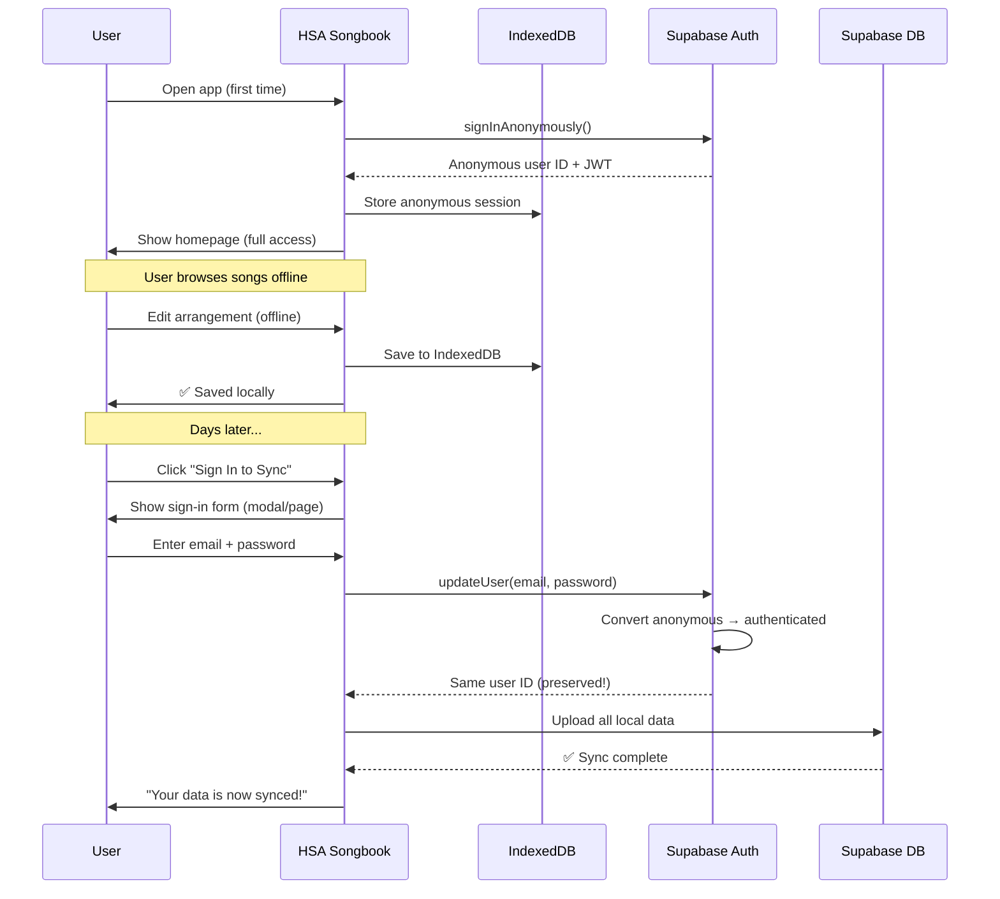
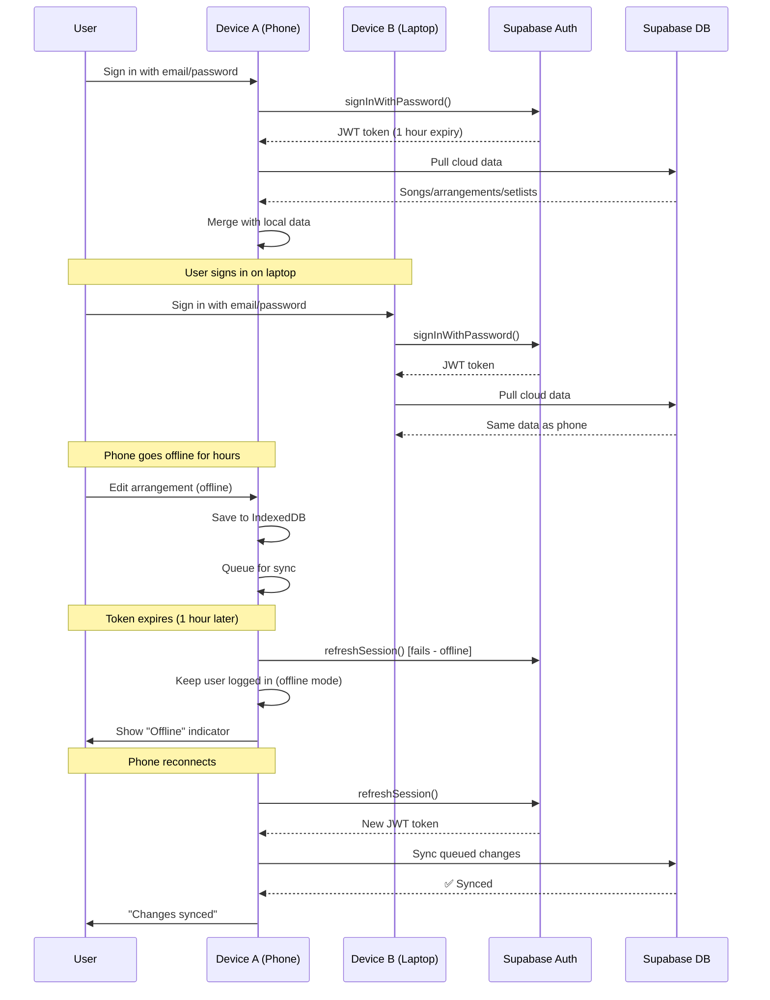
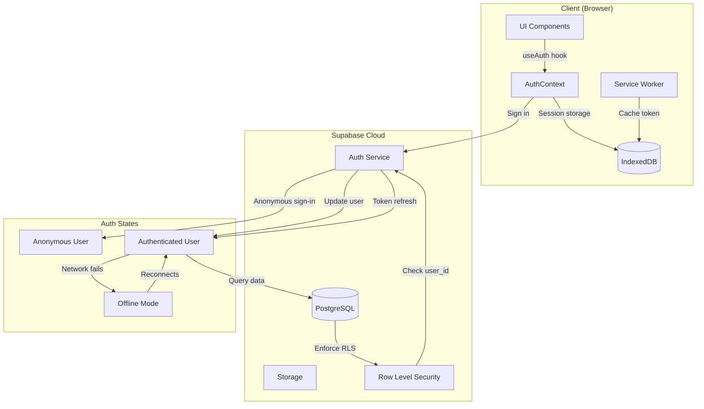
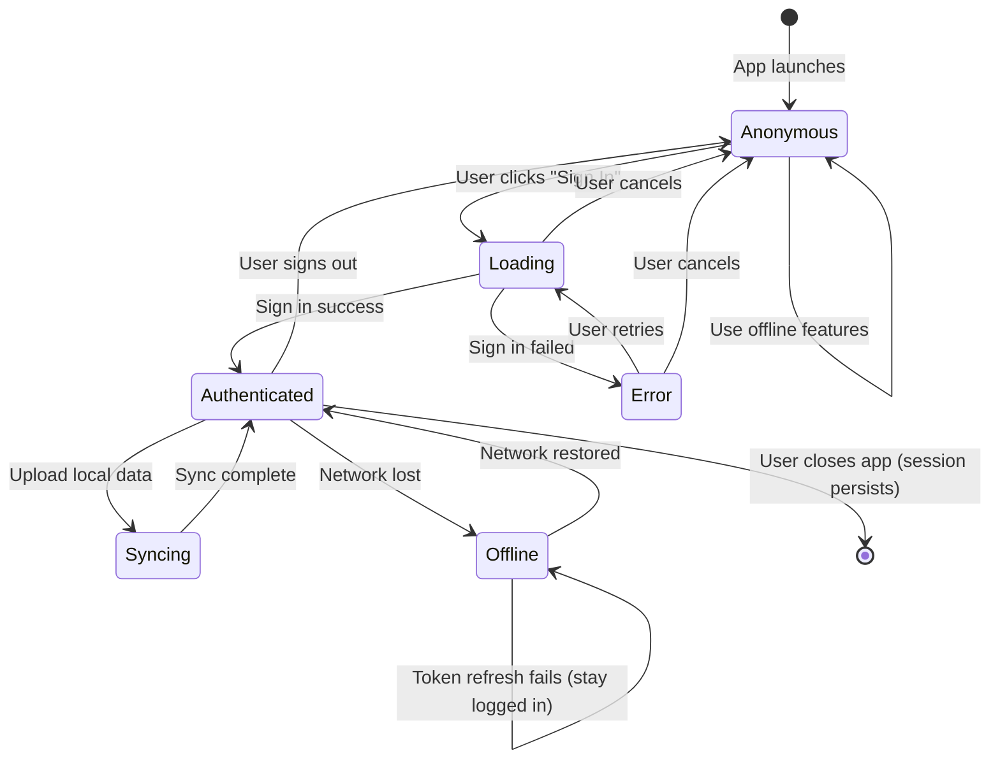
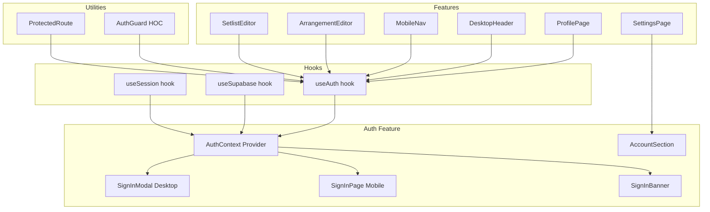
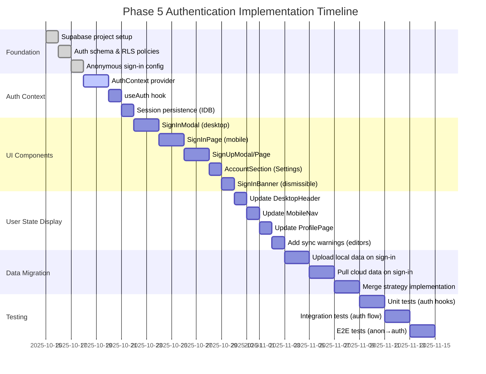

# Phase 5: Authentication Flow - Product Requirements Document

**Status**: Planning
**Phase**: 5 (Cloud Integration - Auth Foundation)
**Created**: 2025-10-14
**Estimated Effort**: 1 week implementation
**Complexity**: Medium
**Priority**: Critical (blocks all Phase 5 features)

---

## Executive Summary

### Problem Statement

HSA Songbook currently operates as a fully offline application with all data stored in IndexedDB. Phase 5 introduces cloud sync via Supabase, which requires user authentication. However, we must preserve the offline-first experience while adding authentication capabilities.

**Key Challenges:**
- **Offline-first preservation**: Users must be able to use the app without signing in (guest mode)
- **Seamless data migration**: When users first sign in, upload their local data to the cloud
- **Mobile-first UX**: Authentication UI must work well on mobile devices
- **Public by default**: Songs/arrangements should be community-shared unless marked private
- **Session persistence**: Handle Supabase token expiry gracefully without disrupting offline usage

### Solution Overview

Implement a **hybrid authentication system** with anonymous sign-in and progressive enhancement:

1. **Anonymous Sign-In (Guest Mode)**: Users can use app fully offline without authentication
2. **Email/Password Authentication**: Simple, traditional auth flow when ready to sync
3. **Progressive Conversion**: Convert anonymous users to authenticated users, preserving data
4. **Hybrid UI Pattern**: Desktop modal + Mobile dedicated page
5. **Public-by-default**: Community library model with optional private arrangements
6. **Supabase Auto-Refresh**: Default token refresh behavior with offline fallback

**Decision Rationale:**
- ✅ **Preserves offline-first**: No auth required for first use (matches Phase 1-4 behavior)
- ✅ **Simple implementation**: Email/password is well-supported by Supabase (OAuth deferred)
- ✅ **Zero data loss**: Anonymous → authenticated conversion preserves user ID
- ✅ **Mobile-optimized**: Dedicated pages avoid modal UX issues on mobile
- ✅ **Community-focused**: Public-by-default encourages sharing worship resources

### Success Metrics

**Primary Metrics:**
- ✅ Zero friction for offline users (no auth wall on first launch)
- ✅ < 5 clicks to create account and sync data
- ✅ 100% data preservation during anonymous → authenticated conversion
- ✅ Session persistence across app restarts (30-day refresh token)

**Secondary Metrics:**
- 📊 Track conversion rate (anonymous → authenticated users)
- 📊 Monitor token expiry issues (target: < 1% of sessions)
- 📊 Measure time-to-first-sync (target: < 10 seconds)

---

## User Stories & Scenarios

### Primary User Flow: Anonymous User (Offline-First)



### Conflict Flow: Authenticated User (Multi-Device Sync)



---

## User Stories

### Story 1: First-Time User (Anonymous Mode)
**As a** worship leader discovering HSA Songbook
**I want** to browse and use the app immediately without signing up
**So that** I can evaluate whether it's useful before committing

**Acceptance Criteria:**
- ✅ App launches without showing auth wall or sign-in prompt
- ✅ User can browse songs, view arrangements, create setlists
- ✅ Anonymous session persists across app restarts
- ✅ Optional banner: "Sign in to sync your data across devices" (dismissible)
- ✅ All features work offline (no degradation)

**Edge Cases:**
- Browser clears storage → New anonymous session created (data lost - acceptable)
- User uninstalls PWA → Data lost (expected behavior)
- User switches browsers → New anonymous session (expected)

**Future Enhancement (Phase 6+):**
- Export data as JSON for backup before clearing browser data

---

### Story 2: Anonymous → Authenticated Conversion
**As a** anonymous user with local data
**I want** to create an account and sync my data to the cloud
**So that** I don't lose my work and can access it on other devices

**Acceptance Criteria:**
- ✅ "Sign in to sync" CTA visible in: Header, Profile page, Settings
- ✅ Sign-in form appears (modal on desktop, page on mobile)
- ✅ User enters email + password → Account created
- ✅ Anonymous user ID is preserved (no new user created)
- ✅ All local data (songs, arrangements, setlists) uploaded to Supabase
- ✅ Sync progress indicator shown during upload
- ✅ Success message: "Your data is now synced! 🎉"

**Edge Cases:**
- Email already exists → Show error: "Email already registered. Sign in instead?"
- Network fails during upload → Retry with exponential backoff
- Large data (100+ arrangements) → Chunked upload with progress bar
- User cancels mid-upload → Resume on next sign-in

**Technical Notes:**
```typescript
// Anonymous → Authenticated conversion
const { data: user, error } = await supabase.auth.updateUser({
  email: 'user@example.com',
  password: 'securepassword'
});

// User ID stays the same! No data migration needed
// Just upload local IndexedDB data to Supabase
```

---

### Story 3: Authenticated User (Multi-Device Sync)
**As a** authenticated user
**I want** to sign in on multiple devices and see my data everywhere
**So that** I can work on my phone during rehearsal and laptop at home

**Acceptance Criteria:**
- ✅ Sign in on Device A → Pull cloud data, merge with local
- ✅ Sign in on Device B → Pull same cloud data
- ✅ Edits on Device A sync to cloud → Device B pulls updates
- ✅ Token refresh happens automatically in background
- ✅ Offline edits queue and sync when reconnected

**Edge Cases:**
- Both devices offline → Sync when reconnected (LWW conflict resolution)
- Token expires while offline → Keep user logged in, refresh when online
- Sign out on one device → Other devices stay signed in (until token expires)

---

### Story 4: Session Persistence (Offline Token Handling)
**As a** authenticated user
**I want** to stay logged in even when offline for days
**So that** I don't have to re-authenticate frequently

**Acceptance Criteria:**
- ✅ Refresh token stored in Supabase storage (30-day expiry)
- ✅ Access token refreshed automatically every hour (foreground)
- ✅ If refresh fails (offline), keep user logged in locally
- ✅ When back online, refresh token and resume sync
- ✅ Only sign out if refresh token is truly expired (30 days)

**Edge Cases:**
- User offline for 31 days → Signed out, data persists locally
- Service worker intercepts token refresh → Allow passthrough
- Clock skew on device → Server timestamp is authoritative

**Technical Notes:**
```typescript
// Supabase auto-refresh with offline fallback
supabase.auth.onAuthStateChange((event, session) => {
  if (event === 'TOKEN_REFRESHED') {
    logger.info('Token refreshed successfully');
  } else if (event === 'SIGNED_OUT') {
    // Only truly signed out if refresh token expired
    logger.warn('User signed out');
  }
});

// Handle offline refresh failure gracefully
supabase.auth.refreshSession().catch(error => {
  if (navigator.onLine) {
    // Online but refresh failed → Real error
    logger.error('Token refresh failed:', error);
  } else {
    // Offline → Keep user logged in, retry later
    logger.debug('Token refresh skipped (offline)');
  }
});
```

---

### Story 5: Public vs Private Arrangements
**As a** worship leader
**I want** my arrangements to be public by default so others can use them
**But** I also want the option to keep some arrangements private

**Acceptance Criteria:**
- ✅ All new arrangements default to `isPublic: true`
- ✅ User can toggle "Private" checkbox when creating/editing
- ✅ Private arrangements only visible to the owner
- ✅ Public arrangements visible to all authenticated users (community library)
- ✅ Anonymous users see only their own local data (no community access until signed in)

**Edge Cases:**
- User creates arrangement as anonymous → Uploaded as public when authenticated
- User marks arrangement private → Removed from community search results
- User switches arrangement from private → public → Appears in community

**Database Schema:**
```typescript
interface Arrangement {
  id: string;
  userId: string; // Owner
  isPublic: boolean; // Default: true
  // ... other fields
}

// Row Level Security (RLS)
// Policy 1: Users can see their own arrangements
CREATE POLICY "Users can view own arrangements"
  ON arrangements FOR SELECT
  USING (auth.uid() = user_id);

// Policy 2: Users can see public arrangements
CREATE POLICY "Users can view public arrangements"
  ON arrangements FOR SELECT
  USING (is_public = true);
```

---

## Technical Architecture

### High-Level Authentication Flow



---

### Authentication State Machine



---

### Component Architecture



---

## Data Model Changes for Authentication

### Current IndexedDB Schema (Phase 4)
```typescript
// src/types/Database.types.ts (current)
export interface HSASongbookDB extends DBSchema {
  songs: { key: string; value: Song };
  arrangements: { key: string; value: Arrangement };
  setlists: { key: string; value: Setlist };
  drafts: { key: string; value: Draft };
}
```

### Enhanced Schema for Auth (Phase 5)
```typescript
// src/types/Database.types.ts (Phase 5 additions)
export interface HSASongbookDB extends DBSchema {
  songs: { key: string; value: Song };
  arrangements: { key: string; value: Arrangement };
  setlists: { key: string; value: Setlist };
  drafts: { key: string; value: Draft };

  // NEW: Auth session storage
  sessions: {
    key: 'current';
    value: {
      userId: string;
      isAnonymous: boolean;
      email?: string;
      accessToken: string;
      refreshToken: string;
      expiresAt: number; // Unix timestamp
      lastRefreshedAt: number;
    };
  };

  // NEW: User preferences
  preferences: {
    key: string; // userId
    value: {
      userId: string;
      theme: 'light' | 'dark' | 'system';
      defaultKey: string;
      autoSync: boolean;
      syncOnMobileData: boolean;
    };
  };
}

// Add userId to all entities
export interface BaseEntity {
  id: string;
  userId: string; // NEW: Owner of this entity
  isPublic: boolean; // NEW: Public vs private flag
  createdAt: string;
  updatedAt: string;
  // ... sync fields from sync conflict resolution PRD
}
```

---

### Supabase PostgreSQL Schema

```sql
-- Phase 5: Authentication-enabled tables

-- Auth users table (managed by Supabase Auth)
-- No need to create, automatically managed

-- Songs table (with auth support)
CREATE TABLE songs (
  id UUID PRIMARY KEY DEFAULT gen_random_uuid(),
  user_id UUID REFERENCES auth.users(id) NOT NULL,
  title TEXT NOT NULL,
  artist TEXT,
  slug TEXT UNIQUE NOT NULL,
  is_public BOOLEAN DEFAULT true,
  themes TEXT[],
  source TEXT,
  notes TEXT,

  -- Metadata
  created_at TIMESTAMPTZ DEFAULT NOW(),
  updated_at TIMESTAMPTZ DEFAULT NOW(),
  version INTEGER DEFAULT 1,
  deleted BOOLEAN DEFAULT false
);

-- Arrangements table (with auth support)
CREATE TABLE arrangements (
  id UUID PRIMARY KEY DEFAULT gen_random_uuid(),
  user_id UUID REFERENCES auth.users(id) NOT NULL,
  song_id UUID REFERENCES songs(id),
  name TEXT NOT NULL,
  slug TEXT UNIQUE NOT NULL,
  chord_pro_content TEXT NOT NULL,
  key TEXT NOT NULL,
  tempo INTEGER,
  capo INTEGER,
  time_signature TEXT,
  rating REAL DEFAULT 0,
  favorites INTEGER DEFAULT 0,
  is_public BOOLEAN DEFAULT true,

  -- Metadata
  created_at TIMESTAMPTZ DEFAULT NOW(),
  updated_at TIMESTAMPTZ DEFAULT NOW(),
  version INTEGER DEFAULT 1,
  deleted BOOLEAN DEFAULT false
);

-- Setlists table (always private to owner)
CREATE TABLE setlists (
  id UUID PRIMARY KEY DEFAULT gen_random_uuid(),
  user_id UUID REFERENCES auth.users(id) NOT NULL,
  name TEXT NOT NULL,
  description TEXT,
  performance_date TIMESTAMPTZ,
  songs JSONB NOT NULL DEFAULT '[]', -- Array of {arrangementId, customKey}

  -- Metadata
  created_at TIMESTAMPTZ DEFAULT NOW(),
  updated_at TIMESTAMPTZ DEFAULT NOW(),
  version INTEGER DEFAULT 1,
  deleted BOOLEAN DEFAULT false
);

-- Indexes for performance
CREATE INDEX idx_songs_user_id ON songs(user_id);
CREATE INDEX idx_songs_public ON songs(is_public) WHERE is_public = true;
CREATE INDEX idx_arrangements_user_id ON arrangements(user_id);
CREATE INDEX idx_arrangements_public ON arrangements(is_public) WHERE is_public = true;
CREATE INDEX idx_setlists_user_id ON setlists(user_id);

-- Row Level Security (RLS)
ALTER TABLE songs ENABLE ROW LEVEL SECURITY;
ALTER TABLE arrangements ENABLE ROW LEVEL SECURITY;
ALTER TABLE setlists ENABLE ROW LEVEL SECURITY;

-- Songs policies
CREATE POLICY "Users can view own songs"
  ON songs FOR SELECT
  USING (auth.uid() = user_id OR is_public = true);

CREATE POLICY "Users can insert own songs"
  ON songs FOR INSERT
  WITH CHECK (auth.uid() = user_id);

CREATE POLICY "Users can update own songs"
  ON songs FOR UPDATE
  USING (auth.uid() = user_id)
  WITH CHECK (auth.uid() = user_id);

CREATE POLICY "Users can delete own songs"
  ON songs FOR DELETE
  USING (auth.uid() = user_id);

-- Arrangements policies (same pattern)
CREATE POLICY "Users can view own or public arrangements"
  ON arrangements FOR SELECT
  USING (auth.uid() = user_id OR is_public = true);

CREATE POLICY "Users can insert own arrangements"
  ON arrangements FOR INSERT
  WITH CHECK (auth.uid() = user_id);

CREATE POLICY "Users can update own arrangements"
  ON arrangements FOR UPDATE
  USING (auth.uid() = user_id);

CREATE POLICY "Users can delete own arrangements"
  ON arrangements FOR DELETE
  USING (auth.uid() = user_id);

-- Setlists policies (always private)
CREATE POLICY "Users can only view own setlists"
  ON setlists FOR SELECT
  USING (auth.uid() = user_id);

CREATE POLICY "Users can insert own setlists"
  ON setlists FOR INSERT
  WITH CHECK (auth.uid() = user_id);

CREATE POLICY "Users can update own setlists"
  ON setlists FOR UPDATE
  USING (auth.uid() = user_id);

CREATE POLICY "Users can delete own setlists"
  ON setlists FOR DELETE
  USING (auth.uid() = user_id);
```

---

## Authentication UI Specifications

### 1. Desktop: Sign-In Modal

**Trigger Locations:**
- Desktop Header (top right): "Sign In" button
- Profile page: "Sign In" CTA
- Settings page (Account section): "Sign In" button

**Modal Design:**
```
┌─────────────────────────────────────────────┐
│  HSA Songbook                          [X]  │
├─────────────────────────────────────────────┤
│                                             │
│   🎵  Sign in to sync your data            │
│                                             │
│   ┌─────────────────────────────────────┐  │
│   │ Email                               │  │
│   │ user@example.com                    │  │
│   └─────────────────────────────────────┘  │
│                                             │
│   ┌─────────────────────────────────────┐  │
│   │ Password                            │  │
│   │ ••••••••••••                        │  │
│   └─────────────────────────────────────┘  │
│                                             │
│   [ ] Remember me                          │
│                                             │
│   ┌─────────────────────────────────────┐  │
│   │         Sign In                     │  │
│   └─────────────────────────────────────┘  │
│                                             │
│   Don't have an account? [Sign Up]         │
│   [Forgot password?]                       │
│                                             │
└─────────────────────────────────────────────┘
```

**Sign-Up Modal (variant):**
```
┌─────────────────────────────────────────────┐
│  HSA Songbook                          [X]  │
├─────────────────────────────────────────────┤
│                                             │
│   🎵  Create your account                   │
│                                             │
│   ┌─────────────────────────────────────┐  │
│   │ Email                               │  │
│   │ user@example.com                    │  │
│   └─────────────────────────────────────┘  │
│                                             │
│   ┌─────────────────────────────────────┐  │
│   │ Password                            │  │
│   │ ••••••••••••                        │  │
│   └─────────────────────────────────────┘  │
│                                             │
│   ┌─────────────────────────────────────┐  │
│   │ Confirm Password                    │  │
│   │ ••••••••••••                        │  │
│   └─────────────────────────────────────┘  │
│                                             │
│   Password requirements:                   │
│   • At least 8 characters                  │
│   • Contains a number or symbol            │
│                                             │
│   ┌─────────────────────────────────────┐  │
│   │         Create Account              │  │
│   └─────────────────────────────────────┘  │
│                                             │
│   Already have an account? [Sign In]       │
│                                             │
└─────────────────────────────────────────────┘
```

---

### 2. Mobile: Dedicated Sign-In Page

**Route:** `/auth/signin`

**Page Design:**
```
┌─────────────────────────────────┐
│  [<] HSA Songbook               │ ← Header
├─────────────────────────────────┤
│                                 │
│         🎵                      │
│    Sign in to sync              │
│                                 │
│  ┌───────────────────────────┐ │
│  │ Email                     │ │
│  │ user@example.com          │ │
│  └───────────────────────────┘ │
│                                 │
│  ┌───────────────────────────┐ │
│  │ Password                  │ │
│  │ ••••••••••••              │ │
│  └───────────────────────────┘ │
│                                 │
│  [ ] Remember me                │
│                                 │
│  ┌───────────────────────────┐ │
│  │      Sign In              │ │
│  └───────────────────────────┘ │
│                                 │
│  Don't have an account?         │
│  [Sign Up]                      │
│                                 │
│  [Forgot password?]             │
│                                 │
│                                 │
│  Or continue without account:   │
│  [Continue as Guest]            │
│                                 │
└─────────────────────────────────┘
```

---

### 3. Desktop Header (Authenticated State)

**Before Sign-In:**
```
┌──────────────────────────────────────────────────┐
│  🎵 HSA Songbook    [Search] [Setlists] [Sign In]│
└──────────────────────────────────────────────────┘
```

**After Sign-In:**
```
┌──────────────────────────────────────────────────┐
│  🎵 HSA Songbook    [Search] [Setlists]  [👤 JD ▾]│
└──────────────────────────────────────────────────┘
                                              │
                    ┌─────────────────────────┘
                    │
             ┌──────────────────┐
             │ John Doe         │
             │ john@church.org  │
             ├──────────────────┤
             │ Profile          │
             │ Settings         │
             │ ───────────      │
             │ Sign Out         │
             └──────────────────┘
```

---

### 4. Sign-In Banner (Dismissible)

**Location:** Homepage (SearchPage), visible to anonymous users

**Design:**
```
┌────────────────────────────────────────────────────────────┐
│  ℹ️  Sign in to sync your data across devices and access  │
│     the community song library.                            │
│     [Sign In] [Create Account]                        [X]  │
└────────────────────────────────────────────────────────────┘
```

---

### 5. Account Section (Settings Page)

**Anonymous User:**
```
┌─────────────────────────────────────────────┐
│  Account                                    │
├─────────────────────────────────────────────┤
│                                             │
│  You're using HSA Songbook as a guest.      │
│                                             │
│  [Sign In] [Create Account]                 │
│                                             │
│  Guest data is stored locally on this       │
│  device and will be synced when you sign in.│
│                                             │
└─────────────────────────────────────────────┘
```

**Authenticated User:**
```
┌─────────────────────────────────────────────┐
│  Account                                    │
├─────────────────────────────────────────────┤
│                                             │
│  Signed in as: john@church.org              │
│                                             │
│  Account created: Oct 14, 2025              │
│  Last synced: 2 minutes ago                 │
│                                             │
│  [Change Password] [Sign Out]               │
│                                             │
│  ───────────────────────────────────────    │
│                                             │
│  Data Sync                                  │
│  [✓] Sync automatically                     │
│  [✓] Sync on mobile data                    │
│                                             │
│  [View Sync History]                        │
│                                             │
└─────────────────────────────────────────────┘
```

---

## User State Display Locations

### 1. Desktop Header ([DesktopHeader.tsx](src/features/shared/components/DesktopHeader.tsx))
**Implementation:**
```tsx
// Top right corner
{user ? (
  <DropdownMenu>
    <DropdownMenuTrigger>
      <Avatar>
        <AvatarFallback>{user.email?.slice(0, 2).toUpperCase()}</AvatarFallback>
      </Avatar>
    </DropdownMenuTrigger>
    <DropdownMenuContent>
      <DropdownMenuLabel>{user.email}</DropdownMenuLabel>
      <DropdownMenuItem onClick={() => navigate('/profile')}>
        Profile
      </DropdownMenuItem>
      <DropdownMenuItem onClick={() => navigate('/settings')}>
        Settings
      </DropdownMenuItem>
      <DropdownMenuSeparator />
      <DropdownMenuItem onClick={handleSignOut}>
        Sign Out
      </DropdownMenuItem>
    </DropdownMenuContent>
  </DropdownMenu>
) : (
  <Button variant="outline" onClick={handleSignIn}>
    Sign In
  </Button>
)}
```

---

### 2. Mobile Navigation ([MobileNav.tsx](src/features/shared/components/MobileNav.tsx))
**Implementation:**
```tsx
// Bottom tab bar - Profile tab
<Link to="/profile" className={tabClass}>
  {user ? (
    <>
      <Avatar size="sm">
        <AvatarFallback>{user.email?.slice(0, 2).toUpperCase()}</AvatarFallback>
      </Avatar>
      <span>Profile</span>
    </>
  ) : (
    <>
      <User className="h-5 w-5" />
      <span>Sign In</span>
    </>
  )}
</Link>
```

---

### 3. Profile Page ([ProfilePage.tsx](src/features/profile/pages/ProfilePage.tsx))
**Current State:** Placeholder with "Coming in Phase 5" message

**Updated Implementation:**
```tsx
{user?.isAnonymous ? (
  <Card>
    <CardContent>
      <CardTitle>Sign in to sync your data</CardTitle>
      <CardDescription>
        Create an account to sync your songs, arrangements, and setlists
        across all your devices.
      </CardDescription>
      <Button onClick={handleSignIn}>Create Account</Button>
      <Button variant="outline" onClick={handleSignIn}>Sign In</Button>
    </CardContent>
  </Card>
) : (
  <Card>
    <CardContent>
      <CardTitle>Profile</CardTitle>
      <div>Email: {user.email}</div>
      <div>Member since: {formatDate(user.createdAt)}</div>
      <div>Last synced: {formatRelativeTime(lastSyncedAt)}</div>
    </CardContent>
  </Card>
)}
```

---

### 4. Settings Page - Account Section ([AccountSection.tsx](src/features/settings/components/AccountSection.tsx))
**See UI mockup above** (Section 5)

---

### 5. Arrangement Editor (Sync Warning)
**Location:** [ArrangementPage.tsx](src/features/arrangements/pages/ArrangementPage.tsx)

**Implementation:**
```tsx
// Show warning banner if user is anonymous and editing
{user?.isAnonymous && (
  <Alert variant="info">
    <InfoIcon className="h-4 w-4" />
    <AlertTitle>Sign in to sync your edits</AlertTitle>
    <AlertDescription>
      Your changes are saved locally. Sign in to sync them across devices.
      <Button size="sm" onClick={handleSignIn}>Sign In</Button>
    </AlertDescription>
  </Alert>
)}
```

---

### 6. Setlist Editor (Sync Warning)
**Location:** [SetlistPage.tsx](src/features/setlists/pages/SetlistPage.tsx)

**Same pattern as Arrangement Editor** (see above)

---

## API Specifications

### 1. Anonymous Sign-In (Automatic on First Launch)

**Endpoint:** Supabase Auth SDK (`supabase.auth.signInAnonymously()`)

**Client Implementation:**
```typescript
// src/features/auth/hooks/useAuth.ts
async function signInAnonymously() {
  const { data, error } = await supabase.auth.signInAnonymously();

  if (error) {
    logger.error('Anonymous sign-in failed:', error);
    throw error;
  }

  logger.info('Anonymous user created:', data.user.id);
  return data.user;
}
```

**Response:**
```json
{
  "user": {
    "id": "550e8400-e29b-41d4-a716-446655440000",
    "is_anonymous": true,
    "aud": "authenticated",
    "created_at": "2025-10-14T10:00:00.000Z"
  },
  "session": {
    "access_token": "eyJhbGciOiJIUzI1NiIsInR5cCI6IkpXVCJ9...",
    "refresh_token": "v1:abc123...",
    "expires_in": 3600,
    "expires_at": 1697281200
  }
}
```

---

### 2. Convert Anonymous to Authenticated (Email/Password)

**Endpoint:** Supabase Auth SDK (`supabase.auth.updateUser()`)

**Client Implementation:**
```typescript
// src/features/auth/hooks/useAuth.ts
async function convertToAuthenticated(email: string, password: string) {
  // Convert anonymous user to authenticated
  const { data: user, error } = await supabase.auth.updateUser({
    email,
    password
  });

  if (error) {
    logger.error('User conversion failed:', error);
    throw error;
  }

  logger.info('Anonymous user converted to authenticated:', user.id);

  // Upload local data to Supabase
  await uploadLocalData(user.id);

  return user;
}
```

**Request:**
```typescript
{
  email: "user@example.com",
  password: "securepassword123"
}
```

**Response:**
```json
{
  "user": {
    "id": "550e8400-e29b-41d4-a716-446655440000", // Same ID!
    "is_anonymous": false,
    "email": "user@example.com",
    "confirmed_at": "2025-10-14T10:05:00.000Z",
    "created_at": "2025-10-14T10:00:00.000Z"
  },
  "session": {
    "access_token": "eyJhbGciOiJIUzI1NiIsInR5cCI6IkpXVCJ9...",
    "refresh_token": "v1:xyz789...",
    "expires_in": 3600
  }
}
```

---

### 3. Sign In with Email/Password (Existing User)

**Endpoint:** Supabase Auth SDK (`supabase.auth.signInWithPassword()`)

**Client Implementation:**
```typescript
async function signIn(email: string, password: string) {
  // Sign out anonymous user first (if any)
  await supabase.auth.signOut();

  // Sign in with credentials
  const { data, error } = await supabase.auth.signInWithPassword({
    email,
    password
  });

  if (error) {
    logger.error('Sign in failed:', error);
    throw error;
  }

  logger.info('User signed in:', data.user.email);

  // Pull cloud data and merge with local
  await syncUserData(data.user.id);

  return data.user;
}
```

---

### 4. Sign Out

**Endpoint:** Supabase Auth SDK (`supabase.auth.signOut()`)

**Client Implementation:**
```typescript
async function signOut() {
  // Clear Supabase session
  const { error } = await supabase.auth.signOut();

  if (error) {
    logger.error('Sign out failed:', error);
    throw error;
  }

  // IMPORTANT: Keep local data in IndexedDB
  // User might want to access offline data as anonymous
  logger.info('User signed out (local data preserved)');

  // Create new anonymous session
  await signInAnonymously();
}
```

---

### 5. Token Refresh (Automatic)

**Endpoint:** Supabase Auth SDK (automatic via `onAuthStateChange`)

**Client Implementation:**
```typescript
// src/features/auth/components/AuthProvider.tsx
useEffect(() => {
  // Listen for auth state changes
  const { data: { subscription } } = supabase.auth.onAuthStateChange(
    async (event, session) => {
      logger.debug('Auth event:', event);

      if (event === 'TOKEN_REFRESHED') {
        logger.info('Token refreshed successfully');
        setSession(session);
      } else if (event === 'SIGNED_IN') {
        logger.info('User signed in');
        setSession(session);
      } else if (event === 'SIGNED_OUT') {
        logger.info('User signed out');
        setSession(null);
      }
    }
  );

  return () => {
    subscription.unsubscribe();
  };
}, []);
```

**Offline Handling:**
```typescript
// Graceful token refresh failure handling
supabase.auth.refreshSession().catch((error) => {
  if (!navigator.onLine) {
    // Offline → Keep user logged in
    logger.debug('Token refresh skipped (offline mode)');
  } else {
    // Online but refresh failed → Real error
    logger.error('Token refresh failed:', error);
    // Optionally sign out user
  }
});
```

---

## Implementation Phases



### Phase 5.0: Authentication Foundation (1 week)
**Goal:** Basic email/password auth with anonymous sign-in

**Tasks:**
1. ✅ **Supabase Setup** (1 day)
   - Create Supabase project
   - Configure authentication settings
   - Enable anonymous sign-ins with CAPTCHA

2. ✅ **Database Schema** (1 day)
   - Add `user_id` and `is_public` fields to all tables
   - Implement Row Level Security policies
   - Test RLS with anonymous and authenticated users

3. ✅ **AuthContext Provider** (4 days)
   - Create `AuthContext` with state management
   - Implement `useAuth()` hook
   - Add session persistence to IndexedDB
   - Handle token refresh with offline fallback

4. ✅ **UI Components** (9 days)
   - Build `SignInModal` (desktop)
   - Build `SignInPage` (mobile)
   - Build `SignUpModal`/`SignUpPage`
   - Update `AccountSection` in Settings
   - Create `SignInBanner` component

5. ✅ **User State Display** (4 days)
   - Update `DesktopHeader` with user dropdown
   - Update `MobileNav` with profile indicator
   - Update `ProfilePage` with auth state
   - Add sync warning banners to editors

6. ✅ **Data Migration** (6 days)
   - Implement "upload local data" on sign-in
   - Implement "pull cloud data" on sign-in
   - Build merge strategy (upload all for MVP)

7. ✅ **Testing** (6 days)
   - Unit tests for auth hooks
   - Integration tests for auth flows
   - E2E tests for anonymous → authenticated conversion

**Success Criteria:**
- ✅ User can use app as anonymous guest (full offline features)
- ✅ User can create account and sync data (zero data loss)
- ✅ User can sign in on multiple devices
- ✅ Token refresh works automatically (foreground + offline fallback)
- ✅ RLS prevents unauthorized access
- ✅ All UI locations show auth state correctly

---

### Phase 5.1: Auth Enhancements (Optional - 1 week)
**Deferred features if time permits:**

**Tasks:**
1. Password reset flow (email link)
2. Email verification
3. OAuth (Google) integration
4. Device management (view active sessions)
5. Account deletion

---

## Risk Assessment & Mitigations

### Technical Risks

#### Risk 1: Anonymous User Data Loss
**Impact:** High
**Likelihood:** Medium
**Description:** User clears browser data, loses all local arrangements

**Mitigation:**
1. **Export feature**: Add "Export all data" button in Settings
2. **Warning on sign-out**: "Your local data will be lost unless synced"
3. **Persistent reminder**: Show "Sign in to sync" banner (dismissible)
4. **Service worker cache**: Store critical data in service worker cache

**Validation:**
```typescript
// Warn before clearing data
window.addEventListener('beforeunload', (event) => {
  if (hasUnsyncedData() && !user) {
    event.preventDefault();
    event.returnValue = 'You have unsynced data. Sign in to save it.';
  }
});
```

---

#### Risk 2: Token Refresh Failure While Offline
**Impact:** Medium
**Likelihood:** High (expected behavior)
**Description:** User offline for > 1 hour, access token expires, refresh fails

**Mitigation:**
1. **Keep user logged in locally**: Don't sign out due to offline refresh failure
2. **Retry on reconnection**: Automatically refresh token when network restored
3. **30-day refresh token**: User has 30 days to reconnect before forced sign-out
4. **Clear UI indicator**: Show "Offline - will sync when online" message

**Technical Implementation:**
```typescript
// Graceful offline token handling
async function handleTokenRefresh() {
  try {
    const { data, error } = await supabase.auth.refreshSession();

    if (error) {
      if (!navigator.onLine) {
        // Offline → Keep user logged in
        logger.debug('Skipping token refresh (offline)');
        return;
      }

      // Online but refresh failed → Check if token truly expired
      const session = await getStoredSession();
      const expiresAt = session?.expiresAt || 0;
      const now = Date.now() / 1000;

      if (expiresAt < now - 86400 * 30) {
        // Refresh token expired (30 days) → Sign out
        logger.warn('Refresh token expired, signing out');
        await signOut();
      }
    }
  } catch (error) {
    logger.error('Token refresh error:', error);
  }
}
```

---

#### Risk 3: Race Condition (Anonymous → Authenticated Conversion)
**Impact:** High
**Likelihood:** Low
**Description:** User converts to authenticated while sync is in progress

**Mitigation:**
1. **Lock UI during conversion**: Disable editing while uploading data
2. **Cancel pending syncs**: Clear sync queue during conversion
3. **Show progress indicator**: "Syncing your data... (50/100 items)"
4. **Idempotent uploads**: Safe to retry failed uploads

**Technical Implementation:**
```typescript
async function convertToAuthenticated(email: string, password: string) {
  // Lock UI
  setIsConverting(true);

  try {
    // 1. Cancel pending anonymous syncs
    await cancelPendingSyncs();

    // 2. Convert user
    const { data: user, error } = await supabase.auth.updateUser({
      email,
      password
    });

    if (error) throw error;

    // 3. Upload local data with progress tracking
    await uploadLocalDataWithProgress(user.id, (progress) => {
      setUploadProgress(progress);
    });

    // 4. Success!
    setIsConverting(false);
    return user;
  } catch (error) {
    setIsConverting(false);
    throw error;
  }
}
```

---

#### Risk 4: Email Already Exists
**Impact:** Medium
**Likelihood:** Medium
**Description:** Anonymous user tries to sign up with email already in use

**Mitigation:**
1. **Check email before conversion**: Query Supabase Auth before calling `updateUser()`
2. **Offer sign-in instead**: "Email already registered. Sign in instead?"
3. **Data preservation**: If user signs in, merge anonymous data with existing account
4. **Clear error message**: "This email is already in use. Would you like to sign in?"

**Technical Implementation:**
```typescript
async function handleSignUp(email: string, password: string) {
  try {
    // Try to convert anonymous user
    const { data, error } = await supabase.auth.updateUser({
      email,
      password
    });

    if (error?.message.includes('already registered')) {
      // Email exists → Offer sign-in
      const confirmed = confirm(
        'This email is already registered. Would you like to sign in instead? ' +
        'Your local data will be merged with your existing account.'
      );

      if (confirmed) {
        await signInAndMergeData(email, password);
      }
    } else if (error) {
      throw error;
    }
  } catch (error) {
    logger.error('Sign up failed:', error);
    throw error;
  }
}
```

---

### Business Risks

#### Risk 5: Users Don't Understand Public vs Private
**Impact:** Medium
**Likelihood:** Medium
**Description:** User expects arrangements to be private, but they're public by default

**Mitigation:**
1. **Onboarding tooltip**: "Your arrangements are public by default (community library)"
2. **Clear UI indicator**: Show "👁️ Public" badge on arrangements
3. **Easy toggle**: Add "Make Private" button in arrangement editor
4. **Settings default**: Allow users to change default privacy setting

**User Education:**
```tsx
// First arrangement creation
{isFirstArrangement && (
  <Alert variant="info">
    <InfoIcon className="h-4 w-4" />
    <AlertTitle>Your arrangements are shared by default</AlertTitle>
    <AlertDescription>
      HSA Songbook is a community library. Your arrangements will be
      visible to other users. You can mark individual arrangements as
      private in the settings.
      <Button size="sm" onClick={dismissTip}>Got it</Button>
    </AlertDescription>
  </Alert>
)}
```

---

#### Risk 6: Low Conversion Rate (Anonymous → Authenticated)
**Impact:** Low (not critical for offline-first app)
**Likelihood:** High
**Description:** Users are happy with offline-only mode, don't see value in signing in

**Mitigation:**
1. **Emphasize benefits**: "Sync across devices", "Backup to cloud", "Access community library"
2. **Non-intrusive CTAs**: Dismissible banner, not blocking modals
3. **Feature gating (optional)**: Require auth for advanced features (e.g., sharing setlists)
4. **Analytics tracking**: Monitor conversion funnel, optimize CTAs

**Conversion Funnel:**
```
1. Anonymous user (100%)
   ↓
2. View "Sign in to sync" banner (80%)
   ↓
3. Click "Sign In" CTA (10%)
   ↓
4. Complete sign-up form (50% of clicks = 5%)
   ↓
5. Successfully authenticated (90% of forms = 4.5%)
```

**Target Conversion Rate:** 5-10% of anonymous users

---

## Success Criteria & Validation

### Phase 5.0 Definition of Done

**Functional Requirements:**
- ✅ User can launch app and use full features as anonymous guest
- ✅ Anonymous user can convert to authenticated (email/password)
- ✅ User ID is preserved during conversion (zero data loss)
- ✅ Local data is uploaded to Supabase on first sign-in
- ✅ Authenticated user can sign in on multiple devices
- ✅ Token refresh works automatically (with offline fallback)
- ✅ Row Level Security prevents unauthorized access
- ✅ Sign-in UI works on desktop (modal) and mobile (page)
- ✅ All UI locations show auth state correctly

**Non-Functional Requirements:**
- ✅ Sign-in flow < 5 clicks (from CTA to authenticated)
- ✅ Data upload on first sign-in < 10 seconds (for 100 arrangements)
- ✅ Token refresh happens silently in background (no UI disruption)
- ✅ Anonymous mode has zero performance impact
- ✅ RLS policies have no measurable query performance impact

**Testing Requirements:**
- ✅ Unit test coverage > 80% for auth hooks
- ✅ Integration tests for all auth flows (sign-up, sign-in, sign-out)
- ✅ E2E tests for anonymous → authenticated conversion
- ✅ Security tests for RLS policies
- ✅ Offline tests (token expiry while offline)

**Documentation:**
- ✅ User guide: "How authentication works in HSA Songbook"
- ✅ Developer docs: Auth architecture and API reference
- ✅ Troubleshooting guide: Common auth issues and solutions

---

## Appendices

### A. Research Summary

**Supabase Anonymous Sign-In:**
- Released in 2024 (relatively new feature)
- Similar to Firebase Anonymous Auth
- Conversion to authenticated preserves user ID
- Requires CAPTCHA to prevent abuse

**Key Learnings:**
- Anonymous sign-in is well-supported and stable
- Conversion is simple (single `updateUser()` call)
- RLS works seamlessly with anonymous users (`is_anonymous` flag)
- Offline token handling requires custom logic (not automatic)

---

### B. Alternative Strategies Considered

#### Option 1: Auth-Required (No Guest Mode)
**Pros:**
- Simpler implementation (no anonymous users)
- Easier data sync (all data has owner)
- Better security (no unauthenticated access)

**Cons:**
- Friction on first launch (sign-up required)
- Bad offline experience (can't use app without account)
- Doesn't match Phase 1-4 offline-first behavior

**Verdict:** Rejected - Preserving offline-first is critical

---

#### Option 2: Magic Links (Passwordless)
**Pros:**
- Modern UX (no password to remember)
- Simpler sign-up flow (just email)
- Built-in email verification

**Cons:**
- Requires email delivery (can fail)
- Can't sign in offline (need to click email link)
- Not ideal for offline-first app
- Deferred to Phase 5.1+

**Verdict:** Deferred to Phase 5.1 (add alongside email/password)

---

#### Option 3: OAuth (Google/Apple)
**Pros:**
- Fastest sign-up (1 click)
- No password management
- Common for church users (Google Workspace)

**Cons:**
- More complex implementation
- Requires redirect flow (interrupts UX)
- Requires OAuth provider setup
- Deferred per user request

**Verdict:** Deferred to Phase 5.1+ (add if users request it)

---

### C. Supabase Configuration

#### Enable Anonymous Sign-Ins

**Dashboard:** Project Settings > Authentication > User Signups

```yaml
# Enable anonymous sign-ins
anonymous_sign_ins: true

# Require CAPTCHA (prevent abuse)
captcha_enabled: true
captcha_provider: hcaptcha # or turnstile
```

**JavaScript SDK Configuration:**
```typescript
// src/lib/supabase.ts
import { createClient } from '@supabase/supabase-js';

const supabaseUrl = import.meta.env.VITE_SUPABASE_URL;
const supabaseAnonKey = import.meta.env.VITE_SUPABASE_ANON_KEY;

export const supabase = createClient(supabaseUrl, supabaseAnonKey, {
  auth: {
    autoRefreshToken: true, // Auto-refresh tokens
    persistSession: true,    // Persist session in localStorage
    detectSessionInUrl: true, // Handle OAuth redirects
  },
});
```

---

### D. Environment Variables

```bash
# .env.local (Phase 5+)
VITE_SUPABASE_URL=https://your-project.supabase.co
VITE_SUPABASE_ANON_KEY=eyJhbGciOiJIUzI1NiIsInR5cCI6IkpXVCJ9...
```

**Security Notes:**
- Anon key is safe to expose (public key)
- Service role key must NEVER be exposed (server-side only)
- RLS policies protect data even with anon key

---

## Next Steps

1. ✅ **Approve this PRD** - Review and sign off on strategy
2. → **Create Supabase project** - Set up project and auth config
3. → **Create Implementation PRPs** - Break down into SPEC/BASE PRPs
4. → **Begin Phase 5.0 development** - Follow gantt chart timeline
5. → **Monitor conversion metrics** - Track anonymous → authenticated rate

**Decision Point:** After 3 months of Phase 5.0 in production:
- If conversion rate < 5% → Improve CTAs and onboarding
- If token expiry complaints → Extend refresh token expiry to 90 days
- If OAuth requests > 20% → Add Google OAuth in Phase 5.1

---

**Document Status:** ✅ Ready for Review
**Author:** Claude (AI Assistant)
**Reviewer:** Project Maintainer
**Last Updated:** 2025-10-14