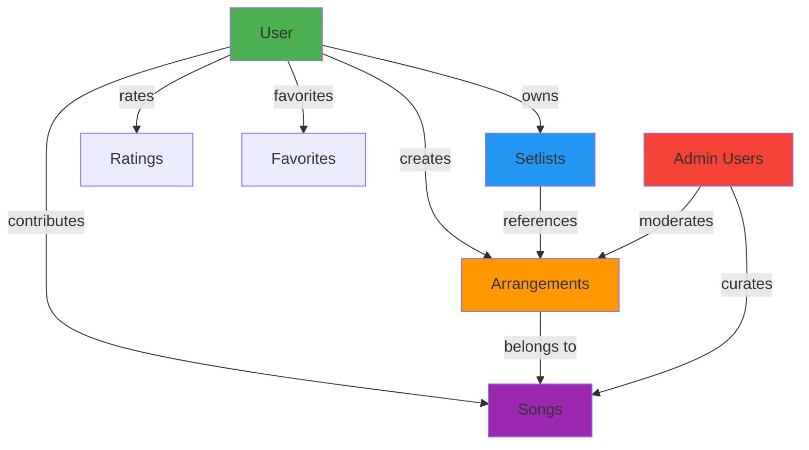
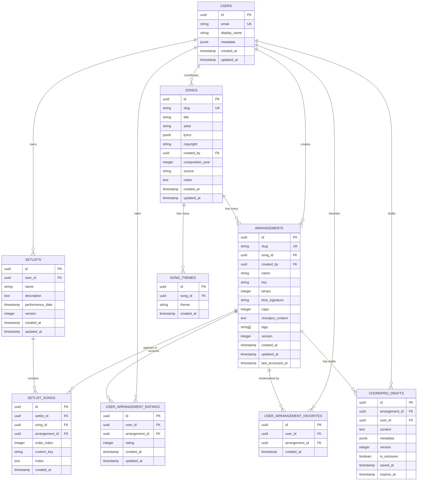
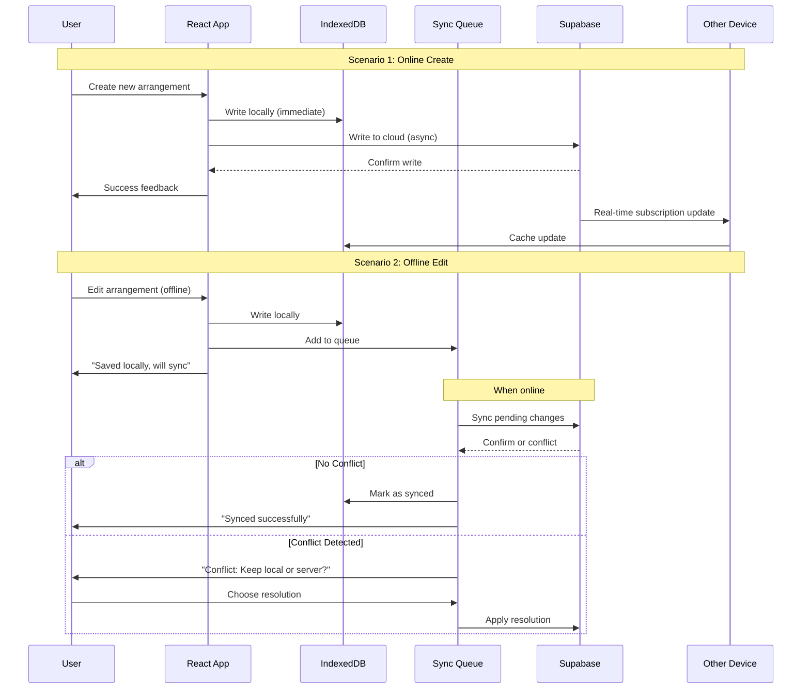

# Phase 5: Data Model Validation & Supabase Schema Design - Planning PRD

**Document Status**: Planning
**Created**: 2025-10-14
**Phase**: 5 (Cloud Integration - Foundation)
**Estimated Effort**: 24-32 hours
**Priority**: Critical (Blocker for Phase 5)

---

## Executive Summary

This PRD defines the complete data model transition from **IndexedDB-only (offline-first)** to **Supabase + IndexedDB (cloud-sync)** architecture for HSA Songbook. It validates that the Supabase PostgreSQL schema matches the existing IndexedDB schema, defines Row Level Security (RLS) policies, and establishes the foundation for user authentication and multi-device sync.

**Key Goals**:
1. ✅ Validate TypeScript types align with database requirements
2. ✅ Design Supabase schema with proper RLS policies
3. ✅ Identify user-owned vs. global data (critical for multi-tenancy)
4. ✅ Define "Add New Song" form requirements
5. ✅ Plan migration strategy from IndexedDB to Supabase
6. ✅ Establish sync architecture (offline-first → cloud-backed)

**Architecture Decision**: **Hybrid Community Library Model**
- **Global Song Library**: Curated collection of worship songs (read-only for most users)
- **User-Created Arrangements**: Users can create custom chord arrangements
- **Personal Setlists**: Private setlist collections owned by users
- **Favorites & Ratings**: User-specific actions tracked in junction tables

---

## 1. Problem Statement

### Current State (Phase 4 Complete)
- ✅ **IndexedDB-only**: All data stored locally in the browser
- ✅ **No user accounts**: Single-device, no sync, no collaboration
- ✅ **Mock data**: Placeholder songs/arrangements seeded on first run
- ✅ **TypeScript types**: Well-defined domain models (Song, Arrangement, Setlist)

### Challenges for Phase 5
1. **No data ownership tracking**: Current schema has no `userId` or `createdBy` fields
2. **No user authentication**: No concept of "logged in user"
3. **Mock data migration**: Need to transition from local mock data to real user-created content
4. **Schema mismatch risk**: IndexedDB and Supabase schemas must align perfectly
5. **RLS policy design**: Must define who can read/write which data

### Target State (Phase 5 End Goal)
- ✅ **Supabase authentication**: Users sign up/login with email or OAuth
- ✅ **Cloud storage**: Supabase PostgreSQL as source of truth
- ✅ **IndexedDB cache**: Local cache for offline support (sync layer)
- ✅ **Multi-device sync**: Changes propagate across user's devices
- ✅ **Row Level Security**: Database-enforced access control
- ✅ **User-created content**: Users can add/edit their own songs/arrangements

---

## 2. Data Ownership Model

### 2.1 Data Classification

| Entity | Ownership | Mutability | Visibility | RLS Policy |
|--------|-----------|------------|------------|------------|
| **Songs** | Global (Community) | Admins + Contributors | Public | Read: Everyone, Write: Authenticated users |
| **Arrangements** | User-owned | Creator only | Public (shareable) | Read: Everyone, Write: Creator only |
| **Setlists** | User-owned | Creator only | Private (Phase 6: shareable) | Read/Write: Creator only |
| **Ratings** | User-owned | Rater only | Aggregated publicly | Write: Creator only, Read: Public (aggregate) |
| **Favorites** | User-owned | User only | Private | Read/Write: Creator only |
| **Drafts** | User-owned | User only | Private | Read/Write: Creator only |

### 2.2 Ownership Hierarchy



### 2.3 User Roles (Future Extension)

| Role | Permissions | Use Case |
|------|-------------|----------|
| **Anonymous** | Read public songs/arrangements | Browsing before signup |
| **Authenticated** | Create arrangements, setlists, rate, favorite | Regular user |
| **Contributor** | Create/edit songs in global library | Trusted community members |
| **Admin** | Full access, moderation, curation | HSA staff |

**MVP (Phase 5)**: Only implement **Anonymous** and **Authenticated** roles. Contributors and Admins deferred to Phase 6+.

---

## 3. Supabase Schema Design

### 3.1 Entity Relationship Diagram



### 3.2 Schema Definition (SQL)

```sql
-- ============================================================================
-- USERS TABLE (Managed by Supabase Auth)
-- ============================================================================
-- NOTE: This table is auto-created by Supabase Auth
-- We'll extend it with a profiles table for additional user data

CREATE TABLE public.profiles (
    id UUID PRIMARY KEY REFERENCES auth.users(id) ON DELETE CASCADE,
    email TEXT NOT NULL UNIQUE,
    display_name TEXT,
    avatar_url TEXT,
    metadata JSONB DEFAULT '{}',
    created_at TIMESTAMP WITH TIME ZONE DEFAULT NOW(),
    updated_at TIMESTAMP WITH TIME ZONE DEFAULT NOW()
);

-- Index for fast lookups
CREATE INDEX idx_profiles_email ON public.profiles(email);

-- Enable RLS
ALTER TABLE public.profiles ENABLE ROW LEVEL SECURITY;

-- RLS Policies for profiles
CREATE POLICY "Users can view their own profile"
    ON public.profiles FOR SELECT
    USING (auth.uid() = id);

CREATE POLICY "Users can update their own profile"
    ON public.profiles FOR UPDATE
    USING (auth.uid() = id);

-- ============================================================================
-- SONGS TABLE (Global Community Library)
-- ============================================================================
CREATE TABLE public.songs (
    id UUID PRIMARY KEY DEFAULT gen_random_uuid(),
    slug TEXT NOT NULL UNIQUE,
    title TEXT NOT NULL,
    artist TEXT,
    lyrics JSONB DEFAULT '{}', -- {"en": "...", "es": "...", etc.}
    copyright TEXT,
    created_by UUID REFERENCES public.profiles(id) ON DELETE SET NULL,
    composition_year INTEGER,
    source TEXT,
    notes TEXT,
    created_at TIMESTAMP WITH TIME ZONE DEFAULT NOW(),
    updated_at TIMESTAMP WITH TIME ZONE DEFAULT NOW(),

    -- Constraints
    CONSTRAINT title_not_empty CHECK (LENGTH(TRIM(title)) > 0),
    CONSTRAINT slug_format CHECK (slug ~ '^[a-z0-9-]+$'),
    CONSTRAINT valid_year CHECK (composition_year >= 1000 AND composition_year <= EXTRACT(YEAR FROM NOW()))
);

-- Indexes
CREATE INDEX idx_songs_slug ON public.songs(slug);
CREATE INDEX idx_songs_title ON public.songs(title);
CREATE INDEX idx_songs_artist ON public.songs(artist);
CREATE INDEX idx_songs_created_by ON public.songs(created_by);
CREATE INDEX idx_songs_created_at ON public.songs(created_at DESC);

-- Full-text search index
CREATE INDEX idx_songs_fts ON public.songs USING GIN (
    to_tsvector('english', COALESCE(title, '') || ' ' || COALESCE(artist, ''))
);

-- Enable RLS
ALTER TABLE public.songs ENABLE ROW LEVEL SECURITY;

-- RLS Policies
CREATE POLICY "Anyone can view songs"
    ON public.songs FOR SELECT
    USING (true);

CREATE POLICY "Authenticated users can create songs"
    ON public.songs FOR INSERT
    WITH CHECK (auth.uid() IS NOT NULL AND auth.uid() = created_by);

CREATE POLICY "Users can update their own songs"
    ON public.songs FOR UPDATE
    USING (auth.uid() = created_by);

CREATE POLICY "Users can delete their own songs"
    ON public.songs FOR DELETE
    USING (auth.uid() = created_by);

-- ============================================================================
-- SONG_THEMES TABLE (Many-to-Many for themes/tags)
-- ============================================================================
CREATE TABLE public.song_themes (
    id UUID PRIMARY KEY DEFAULT gen_random_uuid(),
    song_id UUID NOT NULL REFERENCES public.songs(id) ON DELETE CASCADE,
    theme TEXT NOT NULL,
    created_at TIMESTAMP WITH TIME ZONE DEFAULT NOW(),

    -- Prevent duplicate themes for the same song
    UNIQUE(song_id, theme)
);

-- Indexes
CREATE INDEX idx_song_themes_song_id ON public.song_themes(song_id);
CREATE INDEX idx_song_themes_theme ON public.song_themes(theme);

-- Enable RLS
ALTER TABLE public.song_themes ENABLE ROW LEVEL SECURITY;

-- RLS Policies (inherit from songs table)
CREATE POLICY "Anyone can view song themes"
    ON public.song_themes FOR SELECT
    USING (true);

CREATE POLICY "Theme creator can insert themes"
    ON public.song_themes FOR INSERT
    WITH CHECK (
        EXISTS (
            SELECT 1 FROM public.songs
            WHERE id = song_id AND created_by = auth.uid()
        )
    );

CREATE POLICY "Theme creator can delete themes"
    ON public.song_themes FOR DELETE
    USING (
        EXISTS (
            SELECT 1 FROM public.songs
            WHERE id = song_id AND created_by = auth.uid()
        )
    );

-- ============================================================================
-- ARRANGEMENTS TABLE (User-Created Chord Charts)
-- ============================================================================
CREATE TABLE public.arrangements (
    id UUID PRIMARY KEY DEFAULT gen_random_uuid(),
    slug TEXT NOT NULL UNIQUE,
    song_id UUID NOT NULL REFERENCES public.songs(id) ON DELETE CASCADE,
    created_by UUID NOT NULL REFERENCES public.profiles(id) ON DELETE CASCADE,
    name TEXT NOT NULL,
    key TEXT NOT NULL,
    tempo INTEGER NOT NULL DEFAULT 120,
    time_signature TEXT NOT NULL DEFAULT '4/4',
    capo INTEGER NOT NULL DEFAULT 0,
    chordpro_content TEXT NOT NULL,
    tags TEXT[] DEFAULT '{}',
    version INTEGER NOT NULL DEFAULT 1,
    created_at TIMESTAMP WITH TIME ZONE DEFAULT NOW(),
    updated_at TIMESTAMP WITH TIME ZONE DEFAULT NOW(),
    last_accessed_at TIMESTAMP WITH TIME ZONE,

    -- Constraints
    CONSTRAINT name_not_empty CHECK (LENGTH(TRIM(name)) > 0),
    CONSTRAINT valid_tempo CHECK (tempo >= 40 AND tempo <= 300),
    CONSTRAINT valid_capo CHECK (capo >= 0 AND capo <= 12),
    CONSTRAINT valid_key CHECK (key ~ '^[A-G][b#]?m?$'),
    CONSTRAINT slug_format CHECK (slug ~ '^[a-z0-9]{6}$') -- 6-char nanoid
);

-- Indexes
CREATE INDEX idx_arrangements_slug ON public.arrangements(slug);
CREATE INDEX idx_arrangements_song_id ON public.arrangements(song_id);
CREATE INDEX idx_arrangements_created_by ON public.arrangements(created_by);
CREATE INDEX idx_arrangements_key ON public.arrangements(key);
CREATE INDEX idx_arrangements_created_at ON public.arrangements(created_at DESC);
CREATE INDEX idx_arrangements_last_accessed ON public.arrangements(last_accessed_at DESC NULLS LAST);

-- Enable RLS
ALTER TABLE public.arrangements ENABLE ROW LEVEL SECURITY;

-- RLS Policies
CREATE POLICY "Anyone can view arrangements"
    ON public.arrangements FOR SELECT
    USING (true);

CREATE POLICY "Authenticated users can create arrangements"
    ON public.arrangements FOR INSERT
    WITH CHECK (auth.uid() IS NOT NULL AND auth.uid() = created_by);

CREATE POLICY "Users can update their own arrangements"
    ON public.arrangements FOR UPDATE
    USING (auth.uid() = created_by);

CREATE POLICY "Users can delete their own arrangements"
    ON public.arrangements FOR DELETE
    USING (auth.uid() = created_by);

-- ============================================================================
-- USER_ARRANGEMENT_RATINGS (User-specific ratings)
-- ============================================================================
CREATE TABLE public.user_arrangement_ratings (
    id UUID PRIMARY KEY DEFAULT gen_random_uuid(),
    user_id UUID NOT NULL REFERENCES public.profiles(id) ON DELETE CASCADE,
    arrangement_id UUID NOT NULL REFERENCES public.arrangements(id) ON DELETE CASCADE,
    rating INTEGER NOT NULL,
    created_at TIMESTAMP WITH TIME ZONE DEFAULT NOW(),
    updated_at TIMESTAMP WITH TIME ZONE DEFAULT NOW(),

    -- Constraints
    CONSTRAINT valid_rating CHECK (rating >= 1 AND rating <= 5),
    UNIQUE(user_id, arrangement_id) -- One rating per user per arrangement
);

-- Indexes
CREATE INDEX idx_ratings_user_id ON public.user_arrangement_ratings(user_id);
CREATE INDEX idx_ratings_arrangement_id ON public.user_arrangement_ratings(arrangement_id);

-- Enable RLS
ALTER TABLE public.user_arrangement_ratings ENABLE ROW LEVEL SECURITY;

-- RLS Policies
CREATE POLICY "Users can view their own ratings"
    ON public.user_arrangement_ratings FOR SELECT
    USING (auth.uid() = user_id);

CREATE POLICY "Users can insert their own ratings"
    ON public.user_arrangement_ratings FOR INSERT
    WITH CHECK (auth.uid() = user_id);

CREATE POLICY "Users can update their own ratings"
    ON public.user_arrangement_ratings FOR UPDATE
    USING (auth.uid() = user_id);

CREATE POLICY "Users can delete their own ratings"
    ON public.user_arrangement_ratings FOR DELETE
    USING (auth.uid() = user_id);

-- ============================================================================
-- USER_ARRANGEMENT_FAVORITES (Bookmarking system)
-- ============================================================================
CREATE TABLE public.user_arrangement_favorites (
    id UUID PRIMARY KEY DEFAULT gen_random_uuid(),
    user_id UUID NOT NULL REFERENCES public.profiles(id) ON DELETE CASCADE,
    arrangement_id UUID NOT NULL REFERENCES public.arrangements(id) ON DELETE CASCADE,
    created_at TIMESTAMP WITH TIME ZONE DEFAULT NOW(),

    UNIQUE(user_id, arrangement_id)
);

-- Indexes
CREATE INDEX idx_favorites_user_id ON public.user_arrangement_favorites(user_id);
CREATE INDEX idx_favorites_arrangement_id ON public.user_arrangement_favorites(arrangement_id);

-- Enable RLS
ALTER TABLE public.user_arrangement_favorites ENABLE ROW LEVEL SECURITY;

-- RLS Policies
CREATE POLICY "Users can view their own favorites"
    ON public.user_arrangement_favorites FOR SELECT
    USING (auth.uid() = user_id);

CREATE POLICY "Users can insert their own favorites"
    ON public.user_arrangement_favorites FOR INSERT
    WITH CHECK (auth.uid() = user_id);

CREATE POLICY "Users can delete their own favorites"
    ON public.user_arrangement_favorites FOR DELETE
    USING (auth.uid() = user_id);

-- ============================================================================
-- SETLISTS TABLE (User-owned performance sets)
-- ============================================================================
CREATE TABLE public.setlists (
    id UUID PRIMARY KEY DEFAULT gen_random_uuid(),
    user_id UUID NOT NULL REFERENCES public.profiles(id) ON DELETE CASCADE,
    name TEXT NOT NULL,
    description TEXT,
    performance_date TIMESTAMP WITH TIME ZONE,
    version INTEGER NOT NULL DEFAULT 1,
    created_at TIMESTAMP WITH TIME ZONE DEFAULT NOW(),
    updated_at TIMESTAMP WITH TIME ZONE DEFAULT NOW(),

    CONSTRAINT name_not_empty CHECK (LENGTH(TRIM(name)) > 0)
);

-- Indexes
CREATE INDEX idx_setlists_user_id ON public.setlists(user_id);
CREATE INDEX idx_setlists_performance_date ON public.setlists(performance_date);
CREATE INDEX idx_setlists_created_at ON public.setlists(created_at DESC);

-- Enable RLS
ALTER TABLE public.setlists ENABLE ROW LEVEL SECURITY;

-- RLS Policies
CREATE POLICY "Users can view their own setlists"
    ON public.setlists FOR SELECT
    USING (auth.uid() = user_id);

CREATE POLICY "Users can create their own setlists"
    ON public.setlists FOR INSERT
    WITH CHECK (auth.uid() = user_id);

CREATE POLICY "Users can update their own setlists"
    ON public.setlists FOR UPDATE
    USING (auth.uid() = user_id);

CREATE POLICY "Users can delete their own setlists"
    ON public.setlists FOR DELETE
    USING (auth.uid() = user_id);

-- ============================================================================
-- SETLIST_SONGS TABLE (Junction table for setlist contents)
-- ============================================================================
CREATE TABLE public.setlist_songs (
    id UUID PRIMARY KEY DEFAULT gen_random_uuid(),
    setlist_id UUID NOT NULL REFERENCES public.setlists(id) ON DELETE CASCADE,
    song_id UUID NOT NULL REFERENCES public.songs(id) ON DELETE CASCADE,
    arrangement_id UUID NOT NULL REFERENCES public.arrangements(id) ON DELETE CASCADE,
    order_index INTEGER NOT NULL,
    custom_key TEXT, -- Override arrangement key for this performance
    notes TEXT,
    created_at TIMESTAMP WITH TIME ZONE DEFAULT NOW(),

    CONSTRAINT valid_order CHECK (order_index >= 0),
    UNIQUE(setlist_id, order_index) -- Ensure unique ordering within setlist
);

-- Indexes
CREATE INDEX idx_setlist_songs_setlist_id ON public.setlist_songs(setlist_id, order_index);
CREATE INDEX idx_setlist_songs_arrangement_id ON public.setlist_songs(arrangement_id);

-- Enable RLS
ALTER TABLE public.setlist_songs ENABLE ROW LEVEL SECURITY;

-- RLS Policies (inherit from parent setlist)
CREATE POLICY "Users can view their own setlist songs"
    ON public.setlist_songs FOR SELECT
    USING (
        EXISTS (
            SELECT 1 FROM public.setlists
            WHERE id = setlist_id AND user_id = auth.uid()
        )
    );

CREATE POLICY "Users can insert into their own setlists"
    ON public.setlist_songs FOR INSERT
    WITH CHECK (
        EXISTS (
            SELECT 1 FROM public.setlists
            WHERE id = setlist_id AND user_id = auth.uid()
        )
    );

CREATE POLICY "Users can update their own setlist songs"
    ON public.setlist_songs FOR UPDATE
    USING (
        EXISTS (
            SELECT 1 FROM public.setlists
            WHERE id = setlist_id AND user_id = auth.uid()
        )
    );

CREATE POLICY "Users can delete their own setlist songs"
    ON public.setlist_songs FOR DELETE
    USING (
        EXISTS (
            SELECT 1 FROM public.setlists
            WHERE id = setlist_id AND user_id = auth.uid()
        )
    );

-- ============================================================================
-- CHORDPRO_DRAFTS TABLE (Auto-save functionality)
-- ============================================================================
CREATE TABLE public.chordpro_drafts (
    id UUID PRIMARY KEY DEFAULT gen_random_uuid(),
    arrangement_id UUID NOT NULL REFERENCES public.arrangements(id) ON DELETE CASCADE,
    user_id UUID NOT NULL REFERENCES public.profiles(id) ON DELETE CASCADE,
    content TEXT NOT NULL,
    metadata JSONB DEFAULT '{}',
    version INTEGER NOT NULL DEFAULT 1,
    is_autosave BOOLEAN NOT NULL DEFAULT true,
    saved_at TIMESTAMP WITH TIME ZONE DEFAULT NOW(),
    expires_at TIMESTAMP WITH TIME ZONE NOT NULL,

    UNIQUE(arrangement_id, user_id) -- One draft per user per arrangement
);

-- Indexes
CREATE INDEX idx_drafts_arrangement_id ON public.chordpro_drafts(arrangement_id);
CREATE INDEX idx_drafts_user_id ON public.chordpro_drafts(user_id);
CREATE INDEX idx_drafts_expires_at ON public.chordpro_drafts(expires_at);

-- Enable RLS
ALTER TABLE public.chordpro_drafts ENABLE ROW LEVEL SECURITY;

-- RLS Policies
CREATE POLICY "Users can view their own drafts"
    ON public.chordpro_drafts FOR SELECT
    USING (auth.uid() = user_id);

CREATE POLICY "Users can insert their own drafts"
    ON public.chordpro_drafts FOR INSERT
    WITH CHECK (auth.uid() = user_id);

CREATE POLICY "Users can update their own drafts"
    ON public.chordpro_drafts FOR UPDATE
    USING (auth.uid() = user_id);

CREATE POLICY "Users can delete their own drafts"
    ON public.chordpro_drafts FOR DELETE
    USING (auth.uid() = user_id);

-- ============================================================================
-- DATABASE FUNCTIONS (Helpers & Triggers)
-- ============================================================================

-- Function: Update updated_at timestamp
CREATE OR REPLACE FUNCTION update_updated_at_column()
RETURNS TRIGGER AS $$
BEGIN
    NEW.updated_at = NOW();
    RETURN NEW;
END;
$$ LANGUAGE plpgsql;

-- Apply updated_at trigger to all relevant tables
CREATE TRIGGER update_songs_updated_at BEFORE UPDATE ON public.songs
    FOR EACH ROW EXECUTE FUNCTION update_updated_at_column();

CREATE TRIGGER update_arrangements_updated_at BEFORE UPDATE ON public.arrangements
    FOR EACH ROW EXECUTE FUNCTION update_updated_at_column();

CREATE TRIGGER update_setlists_updated_at BEFORE UPDATE ON public.setlists
    FOR EACH ROW EXECUTE FUNCTION update_updated_at_column();

CREATE TRIGGER update_profiles_updated_at BEFORE UPDATE ON public.profiles
    FOR EACH ROW EXECUTE FUNCTION update_updated_at_column();

CREATE TRIGGER update_ratings_updated_at BEFORE UPDATE ON public.user_arrangement_ratings
    FOR EACH ROW EXECUTE FUNCTION update_updated_at_column();

-- Function: Get arrangement aggregate ratings (for display)
CREATE OR REPLACE FUNCTION get_arrangement_rating_aggregate(arrangement_uuid UUID)
RETURNS TABLE(average_rating NUMERIC, rating_count BIGINT) AS $$
BEGIN
    RETURN QUERY
    SELECT
        ROUND(AVG(rating)::NUMERIC, 1) AS average_rating,
        COUNT(*) AS rating_count
    FROM public.user_arrangement_ratings
    WHERE arrangement_id = arrangement_uuid;
END;
$$ LANGUAGE plpgsql STABLE;

-- Function: Get arrangement favorites count
CREATE OR REPLACE FUNCTION get_arrangement_favorites_count(arrangement_uuid UUID)
RETURNS BIGINT AS $$
BEGIN
    RETURN (
        SELECT COUNT(*)
        FROM public.user_arrangement_favorites
        WHERE arrangement_id = arrangement_uuid
    );
END;
$$ LANGUAGE plpgsql STABLE;

-- Function: Clean up expired drafts (run daily via cron)
CREATE OR REPLACE FUNCTION cleanup_expired_drafts()
RETURNS INTEGER AS $$
DECLARE
    deleted_count INTEGER;
BEGIN
    DELETE FROM public.chordpro_drafts
    WHERE expires_at < NOW();

    GET DIAGNOSTICS deleted_count = ROW_COUNT;
    RETURN deleted_count;
END;
$$ LANGUAGE plpgsql;

-- ============================================================================
-- MATERIALIZED VIEWS (Performance optimization)
-- ============================================================================

-- View: Arrangements with aggregate metrics (for search/browse)
CREATE MATERIALIZED VIEW public.arrangements_with_metrics AS
SELECT
    a.id,
    a.slug,
    a.song_id,
    a.created_by,
    a.name,
    a.key,
    a.tempo,
    a.time_signature,
    a.capo,
    a.tags,
    a.created_at,
    a.updated_at,
    COALESCE(r.average_rating, 0) AS average_rating,
    COALESCE(r.rating_count, 0) AS rating_count,
    COALESCE(f.favorites_count, 0) AS favorites_count
FROM public.arrangements a
LEFT JOIN (
    SELECT
        arrangement_id,
        ROUND(AVG(rating)::NUMERIC, 1) AS average_rating,
        COUNT(*) AS rating_count
    FROM public.user_arrangement_ratings
    GROUP BY arrangement_id
) r ON a.id = r.arrangement_id
LEFT JOIN (
    SELECT
        arrangement_id,
        COUNT(*) AS favorites_count
    FROM public.user_arrangement_favorites
    GROUP BY arrangement_id
) f ON a.id = f.arrangement_id;

-- Index on materialized view
CREATE UNIQUE INDEX idx_arrangements_with_metrics_id ON public.arrangements_with_metrics(id);
CREATE INDEX idx_arrangements_with_metrics_song_id ON public.arrangements_with_metrics(song_id);
CREATE INDEX idx_arrangements_with_metrics_rating ON public.arrangements_with_metrics(average_rating DESC);
CREATE INDEX idx_arrangements_with_metrics_favorites ON public.arrangements_with_metrics(favorites_count DESC);

-- Refresh materialized view (run periodically via cron or trigger)
-- REFRESH MATERIALIZED VIEW CONCURRENTLY public.arrangements_with_metrics;

-- ============================================================================
-- INITIAL DATA SEEDING (Optional: Curated song library)
-- ============================================================================
-- NOTE: This would be populated by an admin import script
-- For MVP, users will create all content themselves
```

---

## 4. TypeScript Type Updates

### 4.1 Updated Song Type

```typescript
/**
 * Song domain model (aligned with Supabase schema)
 */
export interface Song {
  id: string; // UUID in Supabase
  slug: string; // URL-friendly slug (e.g., "amazing-grace-x4k9p")
  title: string;
  artist: string;
  themes?: string[]; // Will be stored in song_themes junction table
  copyright?: string;
  lyrics?: {
    en?: string;
    [language: string]: string | undefined;
  };

  // NEW: User ownership fields
  createdBy?: string; // UUID of creator (null for legacy/imported songs)

  // Metadata fields
  compositionYear?: number;
  source?: string;
  notes?: string;

  // Timestamps
  createdAt: string; // ISO 8601 timestamp
  updatedAt: string; // ISO 8601 timestamp
}
```

### 4.2 Updated Arrangement Type

```typescript
/**
 * Arrangement domain model (aligned with Supabase schema)
 */
export interface Arrangement {
  id: string; // UUID in Supabase
  slug: string; // 6-char nanoid (e.g., "gh2lk")
  songId: string; // Foreign key to songs
  name: string;
  key: string; // Musical key (C, D, E, F, G, A, B, with sharps/flats)
  tempo: number; // BPM (40-300)
  timeSignature: string; // e.g., "4/4", "3/4", "6/8"
  capo: number; // Capo position (0-12)
  tags: string[];
  chordProContent: string; // ChordPro formatted text

  // NEW: User ownership fields
  createdBy: string; // UUID of creator (required)

  // NEW: Aggregate metrics (computed from junction tables)
  averageRating?: number; // Computed from user_arrangement_ratings
  ratingCount?: number; // Count of ratings
  favoritesCount?: number; // Count of favorites

  // Sync fields
  version: number; // For optimistic locking

  // Timestamps
  createdAt: string; // ISO 8601 timestamp
  updatedAt: string; // ISO 8601 timestamp
  lastAccessedAt?: string; // For cleanup operations
}
```

### 4.3 Updated Setlist Type

```typescript
/**
 * Setlist domain model (aligned with Supabase schema)
 */
export interface Setlist {
  id: string; // UUID in Supabase
  name: string;
  description?: string;
  performanceDate?: string; // ISO 8601 timestamp
  songs: SetlistSong[];

  // NEW: User ownership fields
  userId: string; // UUID of owner (required)

  // Sync fields
  version: number; // For optimistic locking

  // Timestamps
  createdAt: string; // ISO 8601 timestamp
  updatedAt: string; // ISO 8601 timestamp
}

export interface SetlistSong {
  id: string; // UUID (unique identifier for this song in the setlist)
  songId: string; // Foreign key to songs
  arrangementId: string; // Foreign key to arrangements
  order: number; // Position in setlist (renamed from 'order' to 'orderIndex' in DB)
  customKey?: string; // Override arrangement key
  notes?: string;
}
```

### 4.4 NEW: User Profile Type

```typescript
/**
 * User profile (extends Supabase Auth user)
 */
export interface UserProfile {
  id: string; // UUID (matches auth.users.id)
  email: string;
  displayName?: string;
  avatarUrl?: string;
  metadata?: Record<string, unknown>;
  createdAt: string;
  updatedAt: string;
}
```

### 4.5 NEW: User Rating & Favorite Types

```typescript
/**
 * User-specific rating for an arrangement
 */
export interface UserArrangementRating {
  id: string; // UUID
  userId: string; // Foreign key to profiles
  arrangementId: string; // Foreign key to arrangements
  rating: number; // 1-5 stars
  createdAt: string;
  updatedAt: string;
}

/**
 * User favorite (bookmark) for an arrangement
 */
export interface UserArrangementFavorite {
  id: string; // UUID
  userId: string; // Foreign key to profiles
  arrangementId: string; // Foreign key to arrangements
  createdAt: string;
}
```

---

## 5. "Add New Song" Form Requirements

### 5.1 User Story

**As a** worship leader
**I want** to add a new song to the songbook
**So that** I can create chord arrangements for songs not yet in the library

### 5.2 Form Fields

| Field | Type | Required | Validation | Notes |
|-------|------|----------|------------|-------|
| **Title** | Text | ✅ Yes | Max 200 chars, not empty | Primary identifier |
| **Artist** | Text | ❌ No | Max 100 chars | Can be "Unknown" or "Traditional" |
| **Themes** | Multi-select | ❌ No | Predefined list + custom | Tags for categorization |
| **Copyright** | Text | ❌ No | Max 200 chars | Copyright info or "Public Domain" |
| **Composition Year** | Number | ❌ No | 1000 - current year | Historical context |
| **Source** | Text | ❌ No | Max 200 chars | Hymnal, album, etc. |
| **Notes** | Textarea | ❌ No | Max 2000 chars | Additional context |
| **Lyrics (English)** | Textarea | ❌ No | Plain text | Optional, for reference |

### 5.3 Predefined Theme Options

```typescript
export const PREDEFINED_THEMES = [
  'worship',
  'praise',
  'grace',
  'salvation',
  'redemption',
  'faith',
  'trust',
  'courage',
  'hope',
  'love',
  'joy',
  'peace',
  'thankfulness',
  'creation',
  'majesty',
  'holiness',
  'prayer',
  'communion',
  'christmas',
  'easter',
  'advent',
  'lent',
  'thanksgiving',
  'mission',
  'service',
] as const;
```

### 5.4 Form Behavior

1. **Auto-generate slug**: Create URL slug from title + nanoid
2. **Auto-set createdBy**: Use authenticated user's UUID
3. **Validation**: Client-side + server-side (Supabase RLS policies)
4. **Success**: Redirect to "Create Arrangement" flow for the new song
5. **Error handling**: Display validation errors inline

### 5.5 Wireframe (Mobile-First)

```
┌─────────────────────────────────┐
│  ← Add New Song                 │ ← Header with back button
├─────────────────────────────────┤
│                                 │
│  Title *                        │
│  ┌─────────────────────────┐   │
│  │ Amazing Grace           │   │
│  └─────────────────────────┘   │
│                                 │
│  Artist                         │
│  ┌─────────────────────────┐   │
│  │ John Newton             │   │
│  └─────────────────────────┘   │
│                                 │
│  Themes                         │
│  ┌─────────────────────────┐   │
│  │ grace, salvation ▼      │   │ ← Multi-select dropdown
│  └─────────────────────────┘   │
│                                 │
│  Copyright                      │
│  ┌─────────────────────────┐   │
│  │ Public Domain           │   │
│  └─────────────────────────┘   │
│                                 │
│  Composition Year               │
│  ┌─────────────────────────┐   │
│  │ 1779                    │   │
│  └─────────────────────────┘   │
│                                 │
│  [Advanced Options ▼]           │ ← Collapsible section
│                                 │
│  ┌─────────────────────────┐   │
│  │  Create Song & Add      │   │ ← Primary action
│  │  Arrangement            │   │
│  └─────────────────────────┘   │
│                                 │
│  [Cancel]                       │ ← Secondary action
│                                 │
└─────────────────────────────────┘
```

---

## 6. Migration Strategy (IndexedDB → Supabase)

### 6.1 Migration Phases


### 6.2 Phase 5.1: Dual Write (Week 1-2)

**Goal**: Write to both IndexedDB and Supabase, read from IndexedDB

**Implementation**:
1. ✅ Add Supabase client setup
2. ✅ Implement authentication (email/password + OAuth)
3. ✅ Create Supabase tables with RLS policies
4. ✅ Update repositories to write to both databases
5. ✅ Keep reading from IndexedDB (fast, no network dependency)

**User Experience**:
- No change for users (still works offline)
- Optional: "Sign in to sync" banner

### 6.3 Phase 5.2: Background Sync (Week 3-4)

**Goal**: Sync IndexedDB ↔ Supabase in the background

**Implementation**:
1. ✅ Implement sync queue (detect offline changes)
2. ✅ Add conflict resolution (last-write-wins for MVP)
3. ✅ Sync on app start, periodically, and on network reconnect
4. ✅ Display sync status indicator

**User Experience**:
- "Syncing..." indicator when online
- "Offline changes will sync when online" message

### 6.4 Phase 5.3: Cloud Primary (Week 5-6)

**Goal**: Read from Supabase (with IndexedDB cache), write to both

**Implementation**:
1. ✅ Fetch data from Supabase on app load
2. ✅ Cache in IndexedDB for offline access
3. ✅ Use Supabase real-time subscriptions for live updates
4. ✅ Fall back to IndexedDB if network unavailable

**User Experience**:
- Seamless experience, data syncs across devices
- "Last synced: 2 minutes ago" indicator

### 6.5 Phase 6: IndexedDB as Cache Only (Future)

**Goal**: Supabase is source of truth, IndexedDB is ephemeral cache

**Implementation**:
1. ✅ Remove version tracking from IndexedDB
2. ✅ Implement cache invalidation strategies
3. ✅ Use service worker for offline caching
4. ✅ Support "clear cache" functionality

---

## 7. Sync Architecture

### 7.1 Data Flow Diagram



### 7.2 Conflict Resolution Strategy

**MVP (Phase 5)**: **Last-Write-Wins (LWW)**
- Use `version` field for optimistic locking
- If version mismatch detected:
  1. Fetch latest from Supabase
  2. Show diff to user
  3. User chooses: "Keep mine" or "Use server version"
  4. Increment version, write to Supabase

**Future (Phase 6+)**: **Operational Transformation (OT)** or **CRDTs**
- Merge changes automatically (like Google Docs)
- Requires more complex backend logic

### 7.3 Sync Queue Implementation

```typescript
/**
 * Sync queue item (stored in IndexedDB, Phase 2 schema)
 */
export interface SyncQueueItem {
  id: string; // UUID
  type: 'song' | 'arrangement' | 'setlist' | 'rating' | 'favorite';
  operation: 'create' | 'update' | 'delete';
  entityId: string; // ID of the song/arrangement/setlist
  data: unknown; // Full entity data
  timestamp: string; // When queued
  retryCount: number; // Number of sync attempts
  maxRetries: number; // Default: 5
  lastError?: string; // Last sync error message
}
```

**Sync Process**:
1. **Queue writes**: When offline, add to `syncQueue` in IndexedDB
2. **Process queue**: On network reconnect, process queue FIFO
3. **Retry logic**: Exponential backoff (2s, 4s, 8s, 16s, 32s)
4. **Conflict handling**: If Supabase returns 409 Conflict, prompt user
5. **Cleanup**: Remove from queue after successful sync or max retries

---

## 8. API Endpoints (Supabase)

### 8.1 RESTful API Design

Supabase auto-generates REST API from schema. We'll use the Supabase JS client for all operations.

| Endpoint | Method | Description | RLS Policy |
|----------|--------|-------------|------------|
| `/songs` | GET | List all songs | Public |
| `/songs` | POST | Create new song | Authenticated |
| `/songs/:id` | GET | Get song by ID | Public |
| `/songs/:id` | PATCH | Update song | Creator only |
| `/songs/:id` | DELETE | Delete song | Creator only |
| `/arrangements` | GET | List arrangements (with filters) | Public |
| `/arrangements` | POST | Create arrangement | Authenticated |
| `/arrangements/:id` | GET | Get arrangement by ID | Public |
| `/arrangements/:id` | PATCH | Update arrangement | Creator only |
| `/arrangements/:id` | DELETE | Delete arrangement | Creator only |
| `/setlists` | GET | List user's setlists | User only |
| `/setlists` | POST | Create setlist | Authenticated |
| `/setlists/:id` | GET | Get setlist by ID | Owner only |
| `/setlists/:id` | PATCH | Update setlist | Owner only |
| `/setlists/:id` | DELETE | Delete setlist | Owner only |
| `/user_arrangement_ratings` | GET | Get user's ratings | User only |
| `/user_arrangement_ratings` | POST | Rate arrangement | Authenticated |
| `/user_arrangement_ratings/:id` | PATCH | Update rating | User only |
| `/user_arrangement_favorites` | GET | Get user's favorites | User only |
| `/user_arrangement_favorites` | POST | Favorite arrangement | Authenticated |
| `/user_arrangement_favorites/:id` | DELETE | Unfavorite arrangement | User only |

### 8.2 Example: Create Arrangement

```typescript
import { supabase } from '@/lib/supabase';
import { nanoid } from 'nanoid';

async function createArrangement(data: {
  songId: string;
  name: string;
  key: string;
  tempo: number;
  timeSignature: string;
  capo: number;
  chordProContent: string;
  tags: string[];
}) {
  const user = await supabase.auth.getUser();
  if (!user.data.user) {
    throw new Error('User not authenticated');
  }

  const arrangement = {
    id: crypto.randomUUID(),
    slug: nanoid(6), // Generate 6-char slug
    song_id: data.songId,
    created_by: user.data.user.id,
    name: data.name,
    key: data.key,
    tempo: data.tempo,
    time_signature: data.timeSignature,
    capo: data.capo,
    chordpro_content: data.chordProContent,
    tags: data.tags,
    version: 1,
    created_at: new Date().toISOString(),
    updated_at: new Date().toISOString(),
  };

  const { data: result, error } = await supabase
    .from('arrangements')
    .insert(arrangement)
    .select()
    .single();

  if (error) {
    throw new Error(`Failed to create arrangement: ${error.message}`);
  }

  return result;
}
```

---

## 9. Implementation Phases

### Phase 5.1: Foundation (Week 1-2, 16-20 hours)

**Tasks**:
1. ✅ Set up Supabase project and configure environment variables
2. ✅ Create SQL migration script (from section 3.2)
3. ✅ Run migration and verify all tables/RLS policies created
4. ✅ Install Supabase JS client (`@supabase/supabase-js`)
5. ✅ Update TypeScript types (add `createdBy`, `userId` fields)
6. ✅ Implement authentication flow (email/password signup/login)
7. ✅ Create `SupabaseProvider` context for React app
8. ✅ Update repositories to dual-write (IndexedDB + Supabase)
9. ✅ Add "Sign in to sync" banner to app
10. ✅ Test CRUD operations with RLS policies

**Deliverables**:
- Working Supabase database with RLS enabled
- Users can sign up and log in
- Data writes to both IndexedDB and Supabase
- No breaking changes to existing offline functionality

### Phase 5.2: Sync Infrastructure (Week 3-4, 20-24 hours)

**Tasks**:
1. ✅ Implement sync queue in IndexedDB
2. ✅ Create `SyncService` to process queue
3. ✅ Add online/offline detection
4. ✅ Implement retry logic with exponential backoff
5. ✅ Add conflict detection (version field comparison)
6. ✅ Create conflict resolution UI (modal with diff view)
7. ✅ Add sync status indicator component
8. ✅ Implement background sync on network reconnect
9. ✅ Add manual "Sync Now" button in settings
10. ✅ Test sync with simulated offline scenarios

**Deliverables**:
- Automatic background sync when online
- Offline changes queued and synced later
- Conflict resolution flow (last-write-wins)
- Sync status visible to user

### Phase 5.3: Real-Time & Optimization (Week 5-6, 16-20 hours)

**Tasks**:
1. ✅ Implement Supabase real-time subscriptions
2. ✅ Update IndexedDB cache when changes detected
3. ✅ Fetch data from Supabase on app load (with loading states)
4. ✅ Implement "Pull to refresh" for manual sync
5. ✅ Add "Last synced" timestamp display
6. ✅ Optimize queries (use materialized view for arrangements)
7. ✅ Add error boundary for sync failures
8. ✅ Implement "Clear local cache" functionality
9. ✅ Add telemetry for sync performance
10. ✅ Comprehensive testing (multi-device, offline/online transitions)

**Deliverables**:
- Real-time updates across devices
- Supabase is primary data source (IndexedDB is cache)
- Optimized performance (fast loads, minimal re-fetches)
- Production-ready sync system

### Phase 5.4: "Add New Song" Form (Week 7, 8-12 hours)

**Tasks**:
1. ✅ Create `AddSongPage` component
2. ✅ Implement form with validation (React Hook Form + Zod)
3. ✅ Add theme multi-select dropdown (predefined + custom)
4. ✅ Implement slug generation (title + nanoid)
5. ✅ Wire up form submission to Supabase
6. ✅ Add success flow: redirect to "Create Arrangement"
7. ✅ Handle validation errors (display inline)
8. ✅ Add form to navigation (Settings → "Add Song" button)
9. ✅ Mobile-optimize form layout
10. ✅ Test form with various inputs

**Deliverables**:
- Users can add new songs to the global library
- Form validates input and shows errors
- Auto-redirects to arrangement creation flow
- Mobile-friendly UI

---

## 10. Risks & Mitigations

| Risk | Impact | Probability | Mitigation |
|------|--------|-------------|------------|
| **RLS policy misconfiguration** | High (data leak) | Medium | Comprehensive testing, security audit, use Supabase policy templates |
| **Sync conflicts data loss** | High (user frustration) | Medium | Implement version tracking, user-friendly conflict UI, backups |
| **Performance degradation** | Medium (slow app) | High | Use materialized views, indexes, lazy loading, pagination |
| **IndexedDB quota exceeded** | Medium (app breaks) | Low | Monitor storage usage, implement cleanup, prompt for upgrade |
| **Supabase cost overruns** | Medium (budget) | Low | Monitor API usage, implement rate limiting, use free tier wisely |
| **User confusion (new auth flow)** | Medium (adoption) | Medium | Clear onboarding, "Skip for now" option, in-app help |
| **Multi-device sync edge cases** | Medium (bugs) | High | Extensive testing, telemetry, graceful error handling |
| **TypeScript migration regressions** | High (broken features) | Low | Already completed Phase 3.5, full test coverage before Phase 5 |

---

## 11. Success Metrics

### Technical Metrics
- ✅ **RLS Coverage**: 100% of tables have RLS enabled
- ✅ **Sync Success Rate**: >95% of sync attempts succeed
- ✅ **Conflict Rate**: <5% of edits result in conflicts
- ✅ **API Latency**: <500ms for 95th percentile
- ✅ **IndexedDB Cache Hit Rate**: >80% of reads from cache
- ✅ **Zero data loss**: No reported data loss incidents

### User Experience Metrics
- ✅ **Authentication conversion**: >60% of users create accounts
- ✅ **Multi-device adoption**: >30% of users use 2+ devices
- ✅ **Sync reliability**: <5% of users report sync issues
- ✅ **Form completion**: >80% of "Add Song" forms submitted
- ✅ **Offline usage**: App works seamlessly offline (no errors)

### Business Metrics (Future)
- User retention: >50% MAU retention after 30 days
- Content growth: >100 user-created songs in first month
- Engagement: >10 songs viewed per session

---

## 12. Open Questions & Decisions Needed

### Critical Decisions (Needed for Phase 5 Start) ✅ APPROVED

1. ✅ **Authentication method**: **Email/password only**
   - OAuth (Google, Apple) deferred to Phase 6+
   - Rationale: Simpler implementation, fewer dependencies, faster MVP

2. ✅ **Supabase pricing tier**: **Free tier (500 MB database, 2 GB bandwidth)**
   - Upgrade to Pro ($25/mo) when hitting limits
   - Rationale: Validate product-market fit before spending, free tier sufficient for MVP

3. ✅ **Conflict resolution UX**: **Modal with diff view**
   - Shows side-by-side comparison of local vs. server version
   - User chooses: "Keep mine" or "Use server version"
   - Rationale: Clearest UX for non-technical users, prevents accidental data loss

4. ✅ **Real-time subscriptions**: **Arrangements and Setlists only**
   - Songs table: No real-time (infrequently edited)
   - Arrangements: Real-time enabled (frequent edits during practice)
   - Setlists: Real-time enabled (users edit setlists often)
   - Rationale: Optimize for common use cases, reduce bandwidth/cost

### Nice-to-Have (Defer to Phase 6+)
- [ ] Social features (follow users, share arrangements)
- [ ] Advanced search (filters, tags, key/tempo ranges)
- [ ] Arrangement versioning (history, rollback)
- [ ] Collaborative setlists (invite others to edit)
- [ ] Public setlist gallery (discover others' setlists)
- [ ] Export to PDF (generate printable chord charts)

---

## 13. Appendices

### A. Supabase Configuration

```typescript
// src/lib/supabase.ts
import { createClient } from '@supabase/supabase-js';
import type { Database } from '@/types/supabase'; // Generated types

const supabaseUrl = import.meta.env.VITE_SUPABASE_URL!;
const supabaseAnonKey = import.meta.env.VITE_SUPABASE_ANON_KEY!;

export const supabase = createClient<Database>(supabaseUrl, supabaseAnonKey, {
  auth: {
    persistSession: true,
    autoRefreshToken: true,
    detectSessionInUrl: true,
  },
  realtime: {
    params: {
      eventsPerSecond: 10, // Rate limit for real-time subscriptions
    },
  },
});
```

### B. Environment Variables

```bash
# .env.local (Phase 5)
VITE_SUPABASE_URL=https://your-project.supabase.co
VITE_SUPABASE_ANON_KEY=your-anon-key-here
```

### C. Type Generation Command

```bash
# Generate TypeScript types from Supabase schema
npx supabase gen types typescript --project-id your-project-id > src/types/supabase.ts
```

### D. Testing Checklist

**Phase 5.1 Testing**:
- [ ] User can sign up with email/password
- [ ] User can log in and session persists
- [ ] RLS policies prevent unauthorized access
- [ ] CRUD operations write to both IndexedDB and Supabase
- [ ] App still works offline (IndexedDB reads)

**Phase 5.2 Testing**:
- [ ] Offline edits added to sync queue
- [ ] Sync queue processes on network reconnect
- [ ] Conflicts detected and resolution UI shown
- [ ] Retry logic works (exponential backoff)
- [ ] Sync status indicator updates correctly

**Phase 5.3 Testing**:
- [ ] Real-time updates reflect on other device
- [ ] App fetches latest data from Supabase on load
- [ ] IndexedDB cache updates from Supabase
- [ ] "Last synced" timestamp displays correctly
- [ ] Multi-device sync works seamlessly

**Phase 5.4 Testing**:
- [ ] "Add Song" form validates all fields
- [ ] Form submission creates song in Supabase
- [ ] Slug auto-generates correctly
- [ ] Success flow redirects to arrangement creation
- [ ] Mobile layout renders properly

---

## 14. Related Documents

- [CLAUDE.md](../CLAUDE.md) - Project development guide
- [Phase 4: Setlist Management PRD](./completed/phase4-setlist-management.md)
- [TypeScript Migration Review](./code_reviews/typescript_migration_review_2025-10-08.md)
- [URL Slug Implementation PRD](./completed/url-slug-implementation-prd.md)

---

**Document End** | Last Updated: 2025-10-14 | Status: Ready for Review
