# Phase 5: Sync Conflict Resolution Strategy - Product Requirements Document

**Status**: Planning
**Phase**: 5 (Cloud Integration)
**Created**: 2025-10-14
**Estimated Effort**: 1 week implementation (simple LWW strategy)
**Complexity**: Medium
**Priority**: High (blocks Phase 5 cloud integration)

---

## Executive Summary

### Problem Statement

HSA Songbook is transitioning from offline-only to offline-first with cloud sync (Phase 5). When users edit data on multiple devices while offline, conflicts will inevitably occur when syncing to Supabase. Without a conflict resolution strategy, data loss or corruption will occur.

**Key Challenges:**
- **Multi-device editing**: User edits arrangement on phone (offline), then edits same arrangement on laptop (offline)
- **Sync timing**: Both devices attempt to sync to Supabase when reconnected
- **Data integrity**: Must prevent data loss or corruption during sync
- **User experience**: Must be transparent and predictable

### Solution Overview

Implement a **Last-Write-Wins (LWW) + Version Vectors** strategy optimized for single-user, multi-device scenarios:

1. **Last-Write-Wins (LWW)**: Simplest conflict resolution - most recent edit wins
2. **Version Vectors**: Track which device made the last change to detect conflicts
3. **Automatic Resolution**: No user intervention required (ship faster, iterate based on real-world data)
4. **Progressive Enhancement**: Start simple, add conflict UI later if needed

**Decision Rationale:**
- ✅ **Simple implementation**: 1 week vs 2-4 weeks for manual resolution UI
- ✅ **Low conflict likelihood**: Rare for single-user to edit same item offline on two devices
- ✅ **Acceptable data loss**: "These are songs, not finance documents" (user quote)
- ✅ **Industry standard**: Used by Notion, Obsidian, Apple Notes for similar use cases
- ✅ **Iterative approach**: Ship fast, add conflict UI later if real-world conflicts are frequent

### Success Metrics

**Primary Metrics:**
- ✅ Zero data corruption during sync (100% integrity)
- ✅ Conflict resolution happens automatically without user intervention
- ✅ Sync latency < 2 seconds per entity (perceived as instant)

**Secondary Metrics:**
- 📊 Track conflict frequency (expect < 1% of syncs)
- 📊 Monitor user reports of "lost changes" (threshold: < 5 reports in 3 months)
- 📊 Measure sync success rate (target: > 99.5%)

**Thresholds for Phase 5.1 (Conflict UI):**
- If conflict frequency > 5% of syncs → Add conflict detection UI
- If user reports > 10 in 3 months → Add manual resolution option
- If data loss complaints → Add "view history" feature

---

## User Stories & Scenarios

### Primary User Flow: Successful Sync (No Conflict)


### Conflict Flow: Last-Write-Wins Resolution

```mermaid
sequenceDiagram
    participant D1 as Device A (Phone)
    participant D2 as Device B (Laptop)
    participant DB as Supabase DB

    Note over D1,D2: Both devices offline

    D1->>D1: Edit Arrangement (v1 → v2)
    D1->>D1: updatedAt: 10:00:00

    D2->>D2: Edit Arrangement (v1 → v2)
    D2->>D2: updatedAt: 10:05:00

    Note over D1,D2: Both reconnect

    D1->>DB: Sync (v2, updatedAt: 10:00:00)
    DB->>DB: Accept (first to arrive)
    DB-->>D1: ✅ Success

    D2->>DB: Sync (v2, updatedAt: 10:05:00)
    DB->>DB: Detect conflict (v2 exists)
    DB->>DB: Compare timestamps
    DB->>DB: 10:05:00 > 10:00:00 → D2 wins
    DB->>DB: Overwrite with D2 data
    DB-->>D2: ✅ Success (LWW)

    Note over D1: Phone's changes silently overwritten

    D1->>DB: Pull latest (next sync)
    DB-->>D1: Return D2's version
    D1->>D1: Update local copy
```



### User Stories

#### Story 1: Single-Device Edit (Happy Path - 95% of cases)
**As a** worship leader
**I want** my edits to sync automatically to the cloud
**So that** I can access them on any device without thinking about sync

**Acceptance Criteria:**
- ✅ Edits made on Device A sync to Supabase within 2 seconds of reconnection
- ✅ Device B pulls latest changes on next refresh
- ✅ No user intervention required
- ✅ Background sync indicator shows progress

**Edge Cases:**
- Offline for extended period (days) → Sync queue persists in IndexedDB
- Large arrangement (>100KB) → Chunked upload with progress indicator
- Network timeout during sync → Retry with exponential backoff

---

#### Story 2: Multi-Device Conflict (LWW Resolution - 5% of cases)
**As a** worship leader
**I want** my most recent edits to take priority
**So that** I don't lose my latest work when syncing from multiple devices

**Acceptance Criteria:**
- ✅ Latest edit (by timestamp) wins automatically
- ✅ No conflict UI shown to user (silent resolution)
- ✅ Overwritten data is **not recoverable** (acceptable trade-off for Phase 5.0)
- ✅ Version number increments correctly

**Edge Cases:**
- Clock skew between devices → Supabase server timestamp is authoritative
- Simultaneous edits (< 1 second apart) → Supabase assigns tie-breaker (e.g., device ID lexicographic order)
- Network partition during sync → Conflict detection on reconnection

**Future Enhancement (Phase 5.1):**
- Add "Changes not saved" notification with option to view conflict
- Add "Restore previous version" option in arrangement history

---

#### Story 3: Create New Entity While Offline
**As a** worship leader
**I want** to create new arrangements while offline
**So that** I can work during rehearsal without internet

**Acceptance Criteria:**
- ✅ New entity gets client-side UUID (nanoid)
- ✅ Sync queue stores entire entity with `operation: 'create'`
- ✅ Supabase inserts new row on sync (no conflict possible)
- ✅ Duplicate IDs are impossible (nanoid collision probability: 1 in 1B)

**Edge Cases:**
- Two devices create entity with same title → Both created (different IDs)
- Sync interrupted mid-upload → Retry with idempotency key

---

#### Story 4: Delete Entity While Offline
**As a** worship leader
**I want** to delete arrangements while offline
**So that** I can clean up my library during rehearsal

**Acceptance Criteria:**
- ✅ Deleted entity is marked `deleted: true` in IndexedDB (soft delete)
- ✅ Sync queue stores `operation: 'delete'`
- ✅ Supabase soft-deletes row on sync
- ✅ Deleted entities hidden from UI but retained for 30 days

**Edge Cases:**
- Device A deletes, Device B edits → LWW applies (edit wins if timestamp > delete timestamp)
- Delete fails on server (entity doesn't exist) → Remove from local IndexedDB

---

## Technical Architecture

### High-Level System Architecture


### Data Model Changes for Sync Support

#### Current IndexedDB Schema (Phase 4)
```typescript
// src/types/Database.types.ts (current)
export interface Arrangement {
  id: string;
  name: string;
  songId: string;
  chordProContent: string;
  key: string;
  tempo?: number;
  capo?: number;
  timeSignature?: string;
  rating: number;
  favorites: number;
  createdAt: string;
  updatedAt: string;
  lastAccessedAt: number;
}
```

#### Enhanced Schema for Sync (Phase 5)
```typescript
// src/types/Database.types.ts (Phase 5 additions)
export interface BaseEntity {
  id: string;
  createdAt: string;
  updatedAt: string; // Client-side timestamp

  // NEW: Sync support fields
  version: number;           // Increments on every edit (1, 2, 3...)
  syncStatus: 'pending' | 'synced' | 'conflict';
  lastSyncedAt?: string;    // Server timestamp (authoritative)
  deviceId: string;          // Which device made the last change
  deleted: boolean;          // Soft delete flag
}

export interface Arrangement extends BaseEntity {
  // ... existing fields ...

  // Conflict metadata (Phase 5.1+)
  conflictedVersions?: ArrangementVersion[]; // History for manual resolution
}

// Version history for conflict resolution UI (Phase 5.1+)
export interface ArrangementVersion {
  version: number;
  content: string;
  updatedAt: string;
  deviceId: string;
  deviceName?: string; // "John's iPhone", "Worship Laptop"
}
```

#### Supabase PostgreSQL Schema
```sql
-- Phase 5: Sync-enabled tables
CREATE TABLE arrangements (
  id UUID PRIMARY KEY,
  user_id UUID REFERENCES auth.users(id) NOT NULL,
  name TEXT NOT NULL,
  song_id UUID REFERENCES songs(id),
  chord_pro_content TEXT NOT NULL,
  key TEXT NOT NULL,
  tempo INTEGER,
  capo INTEGER,
  time_signature TEXT,
  rating REAL DEFAULT 0,
  favorites INTEGER DEFAULT 0,

  -- Sync support fields
  version INTEGER NOT NULL DEFAULT 1,
  created_at TIMESTAMPTZ NOT NULL DEFAULT NOW(),
  updated_at TIMESTAMPTZ NOT NULL DEFAULT NOW(),
  last_synced_at TIMESTAMPTZ DEFAULT NOW(),
  device_id TEXT NOT NULL,
  deleted BOOLEAN DEFAULT FALSE,

  -- Constraints
  CONSTRAINT valid_version CHECK (version > 0)
);

-- Index for conflict detection
CREATE INDEX idx_arrangements_version ON arrangements(id, version);
CREATE INDEX idx_arrangements_updated_at ON arrangements(updated_at DESC);

-- Trigger to auto-increment version on update
CREATE OR REPLACE FUNCTION increment_version()
RETURNS TRIGGER AS $$
BEGIN
  NEW.version = OLD.version + 1;
  NEW.updated_at = NOW();
  RETURN NEW;
END;
$$ LANGUAGE plpgsql;

CREATE TRIGGER arrangements_version_trigger
BEFORE UPDATE ON arrangements
FOR EACH ROW
EXECUTE FUNCTION increment_version();

-- Row Level Security (RLS)
ALTER TABLE arrangements ENABLE ROW LEVEL SECURITY;

CREATE POLICY "Users can view their own arrangements"
  ON arrangements FOR SELECT
  USING (auth.uid() = user_id);

CREATE POLICY "Users can insert their own arrangements"
  ON arrangements FOR INSERT
  WITH CHECK (auth.uid() = user_id);

CREATE POLICY "Users can update their own arrangements"
  ON arrangements FOR UPDATE
  USING (auth.uid() = user_id)
  WITH CHECK (auth.uid() = user_id);
```

---

## Sync Flow Diagrams

### 1. Sync Queue Processing


### 2. Last-Write-Wins Conflict Resolution


### 3. Device Sync State Machine


---

## API Specifications

### 1. Update Arrangement (with conflict detection)

**Endpoint:** `PUT /api/v1/arrangements/:id`

**Request Headers:**
```http
Authorization: Bearer {supabase_jwt_token}
Content-Type: application/json
X-Device-ID: {client_device_id}
```

**Request Body:**
```json
{
  "id": "arr_abc123",
  "name": "Amazing Grace - Contemporary in D",
  "chordProContent": "{title: Amazing Grace}\n{key: D}\n...",
  "key": "D",
  "tempo": 80,
  "capo": 0,
  "version": 5,
  "updatedAt": "2025-10-14T10:05:00.000Z",
  "deviceId": "device_xyz789"
}
```

**Success Response (No Conflict):**
```json
{
  "status": "success",
  "data": {
    "id": "arr_abc123",
    "version": 6,
    "lastSyncedAt": "2025-10-14T10:05:01.234Z",
    "syncStatus": "synced"
  }
}
```

**Conflict Response (LWW Applied - Server Wins):**
```json
{
  "status": "conflict",
  "resolution": "server_wins",
  "message": "Server version is newer. Client should pull latest.",
  "data": {
    "serverVersion": 7,
    "serverUpdatedAt": "2025-10-14T10:07:00.000Z",
    "clientVersion": 5,
    "clientUpdatedAt": "2025-10-14T10:05:00.000Z"
  }
}
```

**Conflict Response (LWW Applied - Client Wins):**
```json
{
  "status": "success",
  "resolution": "client_wins",
  "message": "Client version is newer. Server updated.",
  "data": {
    "id": "arr_abc123",
    "version": 8,
    "lastSyncedAt": "2025-10-14T10:05:01.234Z",
    "syncStatus": "synced",
    "overwrittenVersion": 7
  }
}
```

**Error Responses:**
```json
// 401 Unauthorized
{
  "status": "error",
  "message": "Invalid or expired token"
}

// 404 Not Found
{
  "status": "error",
  "message": "Arrangement not found"
}

// 422 Unprocessable Entity
{
  "status": "error",
  "message": "Invalid version number",
  "details": {
    "expected": "> 0",
    "received": -1
  }
}

// 500 Internal Server Error
{
  "status": "error",
  "message": "Database error",
  "retryable": true
}
```

---

### 2. Batch Sync Endpoint (Optimized)

**Endpoint:** `POST /api/v1/sync/batch`

**Request Body:**
```json
{
  "operations": [
    {
      "type": "arrangements",
      "operation": "update",
      "id": "arr_abc123",
      "data": { /* arrangement data */ },
      "version": 5,
      "updatedAt": "2025-10-14T10:05:00.000Z"
    },
    {
      "type": "setlists",
      "operation": "create",
      "id": "set_xyz789",
      "data": { /* setlist data */ },
      "version": 1,
      "updatedAt": "2025-10-14T10:06:00.000Z"
    }
  ]
}
```

**Response:**
```json
{
  "status": "partial_success",
  "results": [
    {
      "id": "arr_abc123",
      "status": "synced",
      "version": 6
    },
    {
      "id": "set_xyz789",
      "status": "synced",
      "version": 1
    }
  ],
  "summary": {
    "total": 2,
    "synced": 2,
    "conflicts": 0,
    "errors": 0
  }
}
```

---

## Implementation Phases


### Phase 5.0: Core Sync (1 week)
**Goal:** Basic LWW sync working for single-user, multi-device

**Tasks:**
1. ✅ **Foundation** (3 days)
   - Set up Supabase project and authentication
   - Migrate database schema with version/sync fields
   - Implement Row Level Security policies

2. ✅ **Sync Core** (5 days)
   - Add version tracking to IndexedDB entities
   - Implement sync queue in IndexedDB
   - Build background sync poller with exponential backoff
   - Add device ID generation and persistence

3. ✅ **Conflict Resolution** (4 days)
   - Implement LWW resolver on client and server
   - Add timestamp normalization (server authoritative)
   - Handle edge cases (clock skew, simultaneous edits)

4. ✅ **API Layer** (4 days)
   - Build CRUD endpoints with version checking
   - Implement batch sync endpoint
   - Add error handling and retry logic

5. ✅ **UI/UX** (3 days)
   - Add sync status indicators ("Syncing...", "✓ Synced")
   - Show background sync notifications
   - Build error recovery UI ("Retry sync", "View details")

6. ✅ **Testing** (6 days)
   - Unit tests for conflict resolver
   - Integration tests for sync flows
   - End-to-end multi-device tests

**Success Criteria:**
- ✅ User can edit on Device A, sync, and see changes on Device B
- ✅ Conflicts resolve automatically via LWW
- ✅ No data corruption under any scenario
- ✅ Sync queue persists across app restarts

---

### Phase 5.1: Conflict Detection UI (Optional - 1 week)
**Trigger:** If conflict frequency > 5% OR user reports > 10 in 3 months

**Tasks:**
1. Add conflict detection notification ("Your changes may have been overwritten")
2. Build version history viewer (show both versions side-by-side)
3. Add manual resolution UI ("Keep mine", "Keep theirs", "Merge")
4. Implement version history storage (last 5 versions)

**Deferred to Phase 5.1+** (not MVP):
- Manual conflict resolution UI
- Version history viewer
- "Restore previous version" feature
- Real-time collaboration indicators

---

## Risk Assessment & Mitigations

### Technical Risks

#### Risk 1: Clock Skew Between Devices
**Impact:** High
**Likelihood:** Medium
**Description:** If user's device clocks are out of sync, LWW may pick the wrong version

**Mitigation:**
1. Use **server timestamp as authoritative** (Supabase generates `last_synced_at`)
2. Client timestamps are only for **initial conflict detection**, not final resolution
3. Add warning if client clock is >5 minutes off from server
4. Use **version numbers** as primary conflict detection (timestamps are tie-breaker)

**Validation:**
```javascript
// Client-side clock skew detection
const serverTime = new Date(response.headers.get('Date'));
const clientTime = new Date();
const skew = Math.abs(serverTime - clientTime);

if (skew > 5 * 60 * 1000) { // 5 minutes
  logger.warn('Client clock is out of sync with server');
  showNotification('Your device clock may be incorrect. Sync may be unreliable.');
}
```

---

#### Risk 2: Race Condition (Simultaneous Sync)
**Impact:** Medium
**Likelihood:** Low
**Description:** Two devices sync the same entity within milliseconds

**Mitigation:**
1. Supabase handles concurrent writes with **row-level locking** (PostgreSQL)
2. Use **optimistic locking** with version numbers (increment trigger)
3. If race occurs, loser gets `409 Conflict` and retries with fresh data
4. Add **exponential backoff** to prevent retry storms

**Validation:**
```sql
-- PostgreSQL optimistic locking
BEGIN;
UPDATE arrangements
SET chord_pro_content = 'new content', version = version + 1
WHERE id = 'arr_abc123' AND version = 5;

-- If version doesn't match (another update happened), 0 rows affected
-- Client gets 409 and retries
COMMIT;
```

---

#### Risk 3: Sync Queue Growth (Offline for Days)
**Impact:** Medium
**Likelihood:** Medium
**Description:** User is offline for a week, makes 100+ edits, sync queue becomes huge

**Mitigation:**
1. **Coalesce updates**: Only store latest version per entity in queue
   - If user edits arrangement 10 times offline, only sync final version
2. **Batch sync endpoint**: Upload 10-20 items per request (not 1 by 1)
3. **IndexedDB quota check**: Warn user if queue > 10 MB
4. **Sync prioritization**: Sync recent edits first (LRU strategy)

**Validation:**
```javascript
// Queue coalescing logic
function queueSync(entityType, entityId, data) {
  const existingItem = syncQueue.find(
    item => item.type === entityType && item.id === entityId
  );

  if (existingItem) {
    // Update existing queue item (coalesce)
    existingItem.data = data;
    existingItem.updatedAt = new Date().toISOString();
  } else {
    // Add new queue item
    syncQueue.push({ type: entityType, id: entityId, data });
  }
}
```

---

#### Risk 4: Partial Sync Failure
**Impact:** High
**Likelihood:** Medium
**Description:** Network drops mid-sync, some entities synced, others failed

**Mitigation:**
1. **Transactional sync**: Use database transactions for batch operations
2. **Idempotency**: Each sync request has unique ID, safe to retry
3. **Sync status per entity**: Track `pending`, `syncing`, `synced`, `error`
4. **Automatic retry**: Failed items stay in queue, retry on next sync cycle
5. **Manual retry UI**: "Retry failed syncs" button in settings

**Validation:**
```javascript
// Sync with idempotency key
async function syncBatch(items) {
  const idempotencyKey = nanoid();

  try {
    const response = await fetch('/api/v1/sync/batch', {
      method: 'POST',
      headers: {
        'X-Idempotency-Key': idempotencyKey,
        'Authorization': `Bearer ${token}`
      },
      body: JSON.stringify({ operations: items })
    });

    if (!response.ok) throw new Error('Sync failed');

    // Mark items as synced
    for (const item of items) {
      await markSynced(item.id);
    }
  } catch (error) {
    // Keep items in queue, retry later
    logger.error('Sync batch failed:', error);
  }
}
```

---

### Business Risks

#### Risk 5: User Discovers Data Loss
**Impact:** High
**Likelihood:** Low (< 1% based on single-user usage)
**Description:** User edits arrangement on phone, then laptop, loses phone edits

**Mitigation:**
1. **Transparent sync indicators**: Show "Last synced 5 minutes ago" in UI
2. **Pre-edit warning**: "This arrangement was edited on another device. Continue?"
3. **Undo buffer**: Keep last 10 local edits in IndexedDB for recovery
4. **Export backups**: Allow user to export all data as JSON
5. **Phase 5.1 upgrade path**: If complaints occur, add conflict UI

**User Education:**
- Onboarding tooltip: "Your edits sync automatically. Make sure to reconnect to Wi-Fi regularly."
- Settings page: Show sync status and last sync time
- Help docs: Explain how sync works and edge cases

---

#### Risk 6: Supabase Downtime
**Impact:** High
**Likelihood:** Very Low (99.9% uptime SLA)
**Description:** Supabase is down, user can't sync

**Mitigation:**
1. **Offline-first design**: App works 100% offline (already implemented)
2. **Graceful degradation**: Show "Cloud sync unavailable" banner
3. **Retry logic**: Exponential backoff up to 24 hours
4. **Status page**: Link to Supabase status page in error message
5. **Fallback**: User can export data and import elsewhere if needed

---

## Success Criteria & Validation

### Phase 5.0 Definition of Done

**Functional Requirements:**
- ✅ User can edit arrangements on Device A while offline
- ✅ Changes sync to Supabase when reconnected
- ✅ Device B pulls latest changes on next refresh
- ✅ Conflicts resolve automatically via LWW (no user intervention)
- ✅ Sync queue persists across app restarts
- ✅ No data corruption under any scenario

**Non-Functional Requirements:**
- ✅ Sync latency < 2 seconds per entity (90th percentile)
- ✅ Sync success rate > 99.5%
- ✅ IndexedDB storage < 50 MB for 1000 arrangements
- ✅ Background sync doesn't impact UI performance

**Testing Requirements:**
- ✅ Unit test coverage > 80% for sync logic
- ✅ Integration tests for all API endpoints
- ✅ End-to-end multi-device tests (simulate conflicts)
- ✅ Performance tests (1000 queued items)

**Documentation:**
- ✅ User-facing docs: "How sync works" help article
- ✅ Developer docs: Sync architecture and API specs
- ✅ Runbook: Debugging sync issues

---

## Appendices

### A. Research Summary

**Industry Standards:**
- **Notion**: Uses LWW + version vectors for collaborative editing
- **Obsidian**: Uses LWW for vault sync across devices
- **Apple Notes**: Uses LWW with iCloud sync
- **Google Keep**: Uses OT (overkill for our use case)

**Key Learnings:**
- LWW is sufficient for single-user, multi-device scenarios (95% of our users)
- Version vectors prevent the "lost update" problem better than timestamps alone
- Server-authoritative timestamps solve clock skew issues
- Conflict UI can be added later if needed (don't over-engineer MVP)

---

### B. Alternative Strategies Considered

#### Option 1: Manual Conflict Resolution UI
**Pros:**
- Zero data loss
- User has full control
- Better UX for power users

**Cons:**
- 2-4 weeks extra development time
- Requires version history storage (adds complexity)
- Most users won't understand conflict UI
- May cause "decision paralysis"

**Verdict:** Defer to Phase 5.1 if real-world conflicts warrant it

---

#### Option 2: CRDTs (Conflict-Free Replicated Data Types)
**Pros:**
- Automatic merging of concurrent edits
- No conflict resolution needed
- Best for real-time collaboration

**Cons:**
- Massive complexity (Yjs, Automerge libraries)
- ChordPro text is structured (can't naively merge)
- Overkill for single-user, asynchronous edits
- Large library overhead (100KB+)

**Verdict:** Not suitable for this use case

---

#### Option 3: Operational Transformation (OT)
**Pros:**
- Used by Google Docs, Figma
- Handles real-time concurrent edits

**Cons:**
- Extreme complexity (months to implement)
- Requires central server for transformation
- Only needed for simultaneous edits (not our use case)

**Verdict:** Not suitable for this use case

---

### C. Database Migration Script

```sql
-- Phase 5 migration: Add sync support fields
-- Run this after Supabase project is created

-- 1. Add sync fields to existing tables
ALTER TABLE songs
  ADD COLUMN version INTEGER NOT NULL DEFAULT 1,
  ADD COLUMN last_synced_at TIMESTAMPTZ DEFAULT NOW(),
  ADD COLUMN device_id TEXT,
  ADD COLUMN deleted BOOLEAN DEFAULT FALSE;

ALTER TABLE arrangements
  ADD COLUMN version INTEGER NOT NULL DEFAULT 1,
  ADD COLUMN last_synced_at TIMESTAMPTZ DEFAULT NOW(),
  ADD COLUMN device_id TEXT,
  ADD COLUMN deleted BOOLEAN DEFAULT FALSE;

ALTER TABLE setlists
  ADD COLUMN version INTEGER NOT NULL DEFAULT 1,
  ADD COLUMN last_synced_at TIMESTAMPTZ DEFAULT NOW(),
  ADD COLUMN device_id TEXT,
  ADD COLUMN deleted BOOLEAN DEFAULT FALSE;

-- 2. Create indexes for performance
CREATE INDEX idx_songs_version ON songs(id, version);
CREATE INDEX idx_arrangements_version ON arrangements(id, version);
CREATE INDEX idx_setlists_version ON setlists(id, version);

CREATE INDEX idx_songs_updated_at ON songs(updated_at DESC);
CREATE INDEX idx_arrangements_updated_at ON arrangements(updated_at DESC);
CREATE INDEX idx_setlists_updated_at ON setlists(updated_at DESC);

-- 3. Create version increment trigger
CREATE OR REPLACE FUNCTION increment_version()
RETURNS TRIGGER AS $$
BEGIN
  NEW.version = OLD.version + 1;
  NEW.updated_at = NOW();
  RETURN NEW;
END;
$$ LANGUAGE plpgsql;

CREATE TRIGGER songs_version_trigger
BEFORE UPDATE ON songs
FOR EACH ROW
WHEN (OLD.* IS DISTINCT FROM NEW.*)
EXECUTE FUNCTION increment_version();

CREATE TRIGGER arrangements_version_trigger
BEFORE UPDATE ON arrangements
FOR EACH ROW
WHEN (OLD.* IS DISTINCT FROM NEW.*)
EXECUTE FUNCTION increment_version();

CREATE TRIGGER setlists_version_trigger
BEFORE UPDATE ON setlists
FOR EACH ROW
WHEN (OLD.* IS DISTINCT FROM NEW.*)
EXECUTE FUNCTION increment_version();

-- 4. Backfill existing data (if any)
UPDATE songs SET device_id = 'migration_script' WHERE device_id IS NULL;
UPDATE arrangements SET device_id = 'migration_script' WHERE device_id IS NULL;
UPDATE setlists SET device_id = 'migration_script' WHERE device_id IS NULL;
```

---

### D. Device ID Generation

```typescript
// src/features/pwa/utils/deviceId.ts
import { nanoid } from 'nanoid';

/**
 * Get or generate a persistent device ID
 * Stored in localStorage, survives app updates
 */
export function getDeviceId(): string {
  const STORAGE_KEY = 'hsasongbook_device_id';

  let deviceId = localStorage.getItem(STORAGE_KEY);

  if (!deviceId) {
    deviceId = `device_${nanoid(12)}`;
    localStorage.setItem(STORAGE_KEY, deviceId);
    logger.info('Generated new device ID:', deviceId);
  }

  return deviceId;
}

/**
 * Get a human-readable device name
 * User can customize in settings (Phase 5.1+)
 */
export function getDeviceName(): string {
  const STORAGE_KEY = 'hsasongbook_device_name';

  let deviceName = localStorage.getItem(STORAGE_KEY);

  if (!deviceName) {
    // Auto-detect platform
    const platform = navigator.userAgentData?.platform || navigator.platform;
    const isMobile = /Android|iPhone|iPad/i.test(navigator.userAgent);

    deviceName = isMobile ? 'Mobile Device' : 'Desktop Device';
    deviceName += ` (${platform})`;

    localStorage.setItem(STORAGE_KEY, deviceName);
  }

  return deviceName;
}
```

---

## Next Steps

1. ✅ **Approve this PRD** - Review and sign off on strategy
2. → **Create Implementation PRPs** - Break down into SPEC/BASE PRPs
3. → **Set up Supabase project** - Create database, configure auth
4. → **Begin Phase 5.0 development** - Follow gantt chart timeline
5. → **Monitor conflict metrics** - Track real-world conflict frequency

**Decision Point:** After 3 months of Phase 5.0 in production, evaluate metrics:
- If conflict frequency < 5% → Stay with LWW (no UI needed)
- If conflict frequency > 5% → Implement Phase 5.1 conflict UI
- If user complaints > 10 → Add version history viewer

---

**Document Status:** ✅ Ready for Review
**Author:** Claude (AI Assistant)
**Reviewer:** Project Maintainer
**Last Updated:** 2025-10-14
