# Phase 4.5: Profile & Navigation UX Reorganization - Planning PRD

**Document Status**: Planning
**Created**: 2025-10-14
**Phase**: 4.5 (UX Polish & Pre-Cloud Preparation)
**Estimated Effort**: 6-8 hours (MVP), 16-20 hours (Full Phase 5 expansion)
**Priority**: High (Foundation for Phase 5 authentication)

---

## Executive Summary

This PRD redesigns the **user profile and navigation UX** to prepare for Phase 5 (Supabase authentication) while providing a polished offline-first MVP experience. It replaces the current "Settings" link with a **profile dropdown menu** pattern, creates a meaningful profile page with display name management, and establishes the foundation for username/display name distinction, avatar uploads, and user-generated content attribution.

**Key Goals**:
1. ✅ Replace "Settings" nav link with "Profile Avatar" dropdown (desktop)
2. ✅ Create profile page with editable display name (localStorage → Phase 5: Supabase)
3. ✅ Establish username vs. display name architecture (Twitter-style)
4. ✅ Design profile dropdown menu (Profile, Settings, Help & Shortcuts, Sign In)
5. ✅ Plan for Phase 5 expansion (avatar upload, user stats, recent activity)
6. ✅ Maintain mobile-first responsive design

**Architecture Decision**: **Progressive Disclosure with Guest-to-Authenticated Flow**
- **Phase 4.5 MVP**: Guest profile with display name (localStorage only)
- **Phase 5**: Authenticated profile with username, display name, avatar, stats
- **Phase 6+**: Public profiles, user-generated content attribution, social features

---

## 1. Problem Statement

### Current State (Phase 4.5 Pre-Implementation)
- ❌ **"Settings" as top-level nav**: Feels exposed, not standard UX pattern
- ❌ **No profile concept**: No place for user identity or personalization
- ❌ **Profile page placeholder**: Basic "Coming Soon" message, no functionality
- ❌ **No display name**: No way for users to personalize their experience
- ❌ **Not ready for Phase 5**: Authentication UX not planned

### User Pain Points
1. **"Settings feels weird as a primary nav item"** (user feedback)
2. **No personalization**: Can't set a preferred name or identity
3. **No context for future auth**: No clear path to "Sign in to unlock"
4. **Mobile nav cluttered**: 4 buttons (Back, Home, Setlists, Settings) with Settings rarely used

### Target State (Phase 4.5 MVP)
- ✅ **Profile dropdown menu**: Desktop header shows avatar icon → dropdown menu
- ✅ **Profile page with display name**: Users can set a display name (localStorage)
- ✅ **Mobile profile navigation**: Profile replaces Settings in bottom nav
- ✅ **Settings accessed via dropdown**: Secondary navigation pattern
- ✅ **Phase 5 ready**: Clear "Sign In" placeholder with benefits messaging

### Target State (Phase 5 Full Implementation)
- ✅ **Username + Display Name**: `@username` (permanent) + "Display Name" (editable)
- ✅ **Avatar upload**: Via Supabase Storage
- ✅ **User stats**: Songs viewed, arrangements created, setlists, ratings given
- ✅ **Recent activity**: Last 5-10 viewed songs with timestamps
- ✅ **Public profiles**: `/profile/@username` for content attribution

---

## 2. User Stories & Scenarios

### 2.1 Primary User Flow (Phase 4.5 MVP)


### 2.2 User Story: Set Display Name (Phase 4.5 MVP)

**As a** worship leader using HSA Songbook offline
**I want** to set a display name for myself
**So that** I can personalize my experience and prepare for future authentication

**Acceptance Criteria**:
- [ ] First-time users see a display name prompt (non-intrusive)
- [ ] Display name stored in `localStorage` under key `hsasongbook-display-name`
- [ ] Display name shown in profile dropdown menu (desktop)
- [ ] Display name shown on profile page (editable)
- [ ] Display name limited to 50 characters
- [ ] Display name sanitized (no HTML, XSS protection)
- [ ] Display name defaults to "Guest User" if not set

**Edge Cases**:
- Empty display name → default to "Guest User"
- Display name with emoji → allowed (Unicode support)
- Display name with special chars → sanitized (e.g., `<script>` → `&lt;script&gt;`)
- User clears localStorage → display name prompt shown again

**Technical Notes**:
- Use `localStorage.getItem('hsasongbook-display-name')`
- Create `useDisplayName()` hook in `src/features/profile/hooks/`
- Sanitize with `DOMPurify` or custom sanitizer

---

### 2.3 User Story: Profile Dropdown Navigation (Phase 4.5 MVP)

**As a** user on desktop
**I want** to click my profile avatar to open a dropdown menu
**So that** I can quickly access Profile, Settings, and Help

**Acceptance Criteria**:
- [ ] Profile avatar icon replaces "Settings" link in desktop header
- [ ] Avatar shows generic User icon (lucide-react `User`) for MVP
- [ ] Clicking avatar opens dropdown menu with 4 options:
  - **Profile** → `/profile`
  - **Settings** → `/settings`
  - **Help & Shortcuts** → Modal (from Phase 4.5 PRP #4)
  - **Sign In** → Disabled button with tooltip "Coming in Phase 5"
- [ ] Dropdown shows display name at top (e.g., "Guest User")
- [ ] Dropdown shows placeholder email ("guest@local" or "Sign in to sync")
- [ ] Dropdown closes when clicking outside (shadcn/ui DropdownMenu)
- [ ] Dropdown accessible via keyboard (Tab, Enter, Esc)

**Edge Cases**:
- Display name too long → truncate with ellipsis after 30 chars
- Mobile viewport → dropdown not shown (navigate to `/profile` instead)

**Technical Notes**:
- Use shadcn/ui `DropdownMenu` component
- Create `ProfileDropdown.tsx` in `src/features/profile/components/`
- Mobile: Replace Settings button in MobileNav with Profile button

---

### 2.4 User Story: Username vs Display Name (Phase 5 Planning)

**As a** new user signing up in Phase 5
**I want** to choose a unique username and a changeable display name
**So that** my identity is stable while my public name can change

**Acceptance Criteria** (Phase 5):
- [ ] Username requirements:
  - Unique across all users (enforced by Supabase)
  - 3-20 characters, alphanumeric + underscore + hyphen
  - Case-insensitive (`@JohnDoe` = `@johndoe`)
  - Immutable after creation (or rate-limited changes)
  - Shown as `@username` in UI
- [ ] Display name requirements:
  - Non-unique (multiple users can have "John Doe")
  - 1-50 characters, Unicode support (emoji allowed)
  - Changeable anytime
  - Used for comments, ratings, uploaded content attribution
- [ ] Profile URLs use username: `/profile/@johndoe`
- [ ] Content attribution shows display name + username: "John Doe (@johndoe)"

**Data Model** (Phase 5 Supabase schema):
```sql
CREATE TABLE profiles (
  id UUID PRIMARY KEY REFERENCES auth.users(id),
  username TEXT UNIQUE NOT NULL CHECK (username ~* '^[a-z0-9_-]{3,20}$'),
  display_name TEXT NOT NULL CHECK (char_length(display_name) <= 50),
  avatar_url TEXT,
  created_at TIMESTAMPTZ DEFAULT NOW(),
  updated_at TIMESTAMPTZ DEFAULT NOW()
);

CREATE INDEX idx_profiles_username ON profiles(LOWER(username));
```

**Migration Path**:
- Phase 4.5: Display name only (localStorage)
- Phase 5: On first sign-in, prompt for username (suggest username from display name)
- Phase 5: Migrate localStorage display name to Supabase `profiles.display_name`

---

## 3. System Architecture

### 3.1 Component Hierarchy (Phase 4.5 MVP)


### 3.2 Data Flow (Phase 4.5 MVP)

```mermaid
sequenceDiagram
    participant U as User
    participant PD as ProfileDropdown
    participant PP as ProfilePage
    participant UDN as useDisplayName Hook
    participant LS as localStorage

    U->>PD: Click Profile Avatar
    PD->>UDN: getDisplayName()
    UDN->>LS: localStorage.getItem('hsasongbook-display-name')
    LS-->>UDN: "Guest User"
    UDN-->>PD: displayName = "Guest User"
    PD-->>U: Show Dropdown with name

    U->>PP: Navigate to /profile
    PP->>UDN: getDisplayName()
    UDN-->>PP: "Guest User"
    PP-->>U: Render ProfilePage

    U->>PP: Edit display name → "John Doe"
    PP->>UDN: setDisplayName("John Doe")
    UDN->>LS: localStorage.setItem('hsasongbook-display-name', 'John Doe')
    LS-->>UDN: Success
    UDN-->>PP: displayName updated
    PP-->>U: Show success message
```



### 3.3 Navigation Reorganization

**Before (Current):**
```
Desktop Header: [Logo] [Search] [Setlists] [Settings] [ThemeToggle]
Mobile Bottom: [Back] [Home] [Setlists] [Settings]
```

**After (Phase 4.5 MVP):**
```
Desktop Header: [Logo] [Search] [Setlists] [ThemeToggle] [ProfileAvatar▼]
Mobile Bottom: [Back] [Home] [Setlists] [Profile]
```

**Profile Dropdown Menu (Desktop):**
```
┌─────────────────────────────┐
│ Guest User                  │ ← Display name
│ guest@local                 │ ← Placeholder email
├─────────────────────────────┤
│ 👤 Profile                  │ → /profile
│ ⚙️  Settings                 │ → /settings
│ ❓ Help & Shortcuts         │ → Opens modal
├─────────────────────────────┤
│ 🔐 Sign In                  │ → Disabled (Phase 5)
│    (Coming in Phase 5)      │
└─────────────────────────────┘
```

---

## 4. Technical Specifications

### 4.1 New Components

#### `ProfileDropdown.tsx` (Desktop Only)
```typescript
/**
 * ProfileDropdown Component
 *
 * Desktop-only dropdown menu accessed via profile avatar.
 * Shows user display name, email placeholder, and navigation links.
 * Hidden on mobile (< 768px).
 */

import { User, Settings, HelpCircle, LogIn } from 'lucide-react';
import { useNavigate } from 'react-router-dom';
import {
  DropdownMenu,
  DropdownMenuContent,
  DropdownMenuItem,
  DropdownMenuLabel,
  DropdownMenuSeparator,
  DropdownMenuTrigger,
} from '@/components/ui/dropdown-menu';
import { Button } from '@/components/ui/button';
import { useDisplayName } from '../hooks/useDisplayName';

interface ProfileDropdownProps {
  /**
   * Callback to open Help & Shortcuts modal
   */
  onOpenHelp?: () => void;
}

export function ProfileDropdown({ onOpenHelp }: ProfileDropdownProps) {
  const navigate = useNavigate();
  const { displayName } = useDisplayName();

  return (
    <DropdownMenu>
      <DropdownMenuTrigger asChild>
        <Button
          variant="ghost"
          size="icon"
          className="rounded-full"
          aria-label="Open profile menu"
        >
          <User className="h-5 w-5" />
        </Button>
      </DropdownMenuTrigger>

      <DropdownMenuContent align="end" className="w-56">
        {/* User Info Header */}
        <DropdownMenuLabel>
          <div className="flex flex-col space-y-1">
            <p className="text-sm font-medium leading-none">{displayName}</p>
            <p className="text-xs leading-none text-muted-foreground">
              guest@local
            </p>
          </div>
        </DropdownMenuLabel>

        <DropdownMenuSeparator />

        {/* Navigation Items */}
        <DropdownMenuItem onClick={() => navigate('/profile')}>
          <User className="mr-2 h-4 w-4" />
          <span>Profile</span>
        </DropdownMenuItem>

        <DropdownMenuItem onClick={() => navigate('/settings')}>
          <Settings className="mr-2 h-4 w-4" />
          <span>Settings</span>
        </DropdownMenuItem>

        <DropdownMenuItem onClick={onOpenHelp}>
          <HelpCircle className="mr-2 h-4 w-4" />
          <span>Help &amp; Shortcuts</span>
        </DropdownMenuItem>

        <DropdownMenuSeparator />

        {/* Sign In (Disabled for Phase 4.5) */}
        <DropdownMenuItem disabled>
          <LogIn className="mr-2 h-4 w-4" />
          <span>Sign In</span>
          <span className="ml-auto text-xs text-muted-foreground">
            (Phase 5)
          </span>
        </DropdownMenuItem>
      </DropdownMenuContent>
    </DropdownMenu>
  );
}
```

#### `useDisplayName.ts` Hook
```typescript
/**
 * useDisplayName Hook
 *
 * Manages user display name in localStorage (Phase 4.5 MVP).
 * Will be replaced with Supabase in Phase 5.
 */

import { useState, useEffect, useCallback } from 'react';
import logger from '@/lib/logger';

const STORAGE_KEY = 'hsasongbook-display-name';
const DEFAULT_DISPLAY_NAME = 'Guest User';

interface UseDisplayNameReturn {
  displayName: string;
  setDisplayName: (name: string) => void;
  isLoading: boolean;
}

/**
 * Hook to manage user display name
 *
 * Phase 4.5: localStorage only
 * Phase 5: Replace with Supabase profiles table
 */
export function useDisplayName(): UseDisplayNameReturn {
  const [displayName, setDisplayNameState] = useState<string>(DEFAULT_DISPLAY_NAME);
  const [isLoading, setIsLoading] = useState<boolean>(true);

  // Load display name from localStorage on mount
  useEffect(() => {
    try {
      const stored = localStorage.getItem(STORAGE_KEY);
      if (stored) {
        setDisplayNameState(stored);
      }
    } catch (error) {
      logger.error('Failed to load display name from localStorage:', error);
    } finally {
      setIsLoading(false);
    }
  }, []);

  // Save display name to localStorage
  const setDisplayName = useCallback((name: string) => {
    try {
      // Sanitize input (basic XSS protection)
      const sanitized = name.trim().slice(0, 50);

      if (!sanitized) {
        setDisplayNameState(DEFAULT_DISPLAY_NAME);
        localStorage.removeItem(STORAGE_KEY);
        return;
      }

      setDisplayNameState(sanitized);
      localStorage.setItem(STORAGE_KEY, sanitized);
      logger.debug('Display name saved:', sanitized);
    } catch (error) {
      logger.error('Failed to save display name to localStorage:', error);
    }
  }, []);

  return { displayName, setDisplayName, isLoading };
}
```

#### `DisplayNameForm.tsx` Component
```typescript
/**
 * DisplayNameForm Component
 *
 * Allows users to edit their display name.
 * Used on ProfilePage.
 */

import { useState } from 'react';
import { Input } from '@/components/ui/input';
import { Button } from '@/components/ui/button';
import { Label } from '@/components/ui/label';
import { Card, CardContent, CardHeader, CardTitle } from '@/components/ui/card';
import { useDisplayName } from '../hooks/useDisplayName';

export function DisplayNameForm() {
  const { displayName, setDisplayName } = useDisplayName();
  const [value, setValue] = useState<string>(displayName);
  const [isSaving, setIsSaving] = useState<boolean>(false);

  const handleSubmit = (e: React.FormEvent) => {
    e.preventDefault();
    setIsSaving(true);
    setDisplayName(value);

    // Simulate async save (for Phase 5 Supabase transition)
    setTimeout(() => {
      setIsSaving(false);
    }, 300);
  };

  return (
    <Card>
      <CardHeader>
        <CardTitle>Display Name</CardTitle>
      </CardHeader>
      <CardContent>
        <form onSubmit={handleSubmit} className="space-y-4">
          <div className="space-y-2">
            <Label htmlFor="displayName">
              Name shown to others (Phase 5: when you rate or upload songs)
            </Label>
            <Input
              id="displayName"
              type="text"
              value={value}
              onChange={(e) => setValue(e.target.value)}
              maxLength={50}
              placeholder="Enter your display name"
              aria-describedby="displayName-help"
            />
            <p id="displayName-help" className="text-xs text-muted-foreground">
              This is your public name (editable). In Phase 5, you'll also have a username like @johndoe.
            </p>
          </div>

          <Button type="submit" disabled={isSaving || value === displayName}>
            {isSaving ? 'Saving...' : 'Save Changes'}
          </Button>
        </form>
      </CardContent>
    </Card>
  );
}
```

### 4.2 Updated Components

#### `DesktopHeader.tsx` Changes
```diff
  import { Home, List, Search, Settings } from 'lucide-react';
+ import { ProfileDropdown } from '@/features/profile/components/ProfileDropdown';
+ import { useState } from 'react';
+ import { KeyboardShortcutsModal } from '@/features/shared/components/KeyboardShortcutsModal';

  export default function DesktopHeader({ className }: DesktopHeaderProps) {
+   const [isHelpModalOpen, setIsHelpModalOpen] = useState(false);

    return (
      <header>
        <div className="container flex h-16 items-center justify-between">
          {/* Logo */}

          {/* Navigation Links */}
          <nav>
            <ul className="flex items-center space-x-6">
              <li>Search</li>
              <li>Setlists</li>
-             <li>Settings</li>
            </ul>
          </nav>

          {/* Theme Toggle + Profile Dropdown */}
-         <ThemeToggle />
+         <div className="flex items-center space-x-4">
+           <ThemeToggle />
+           <ProfileDropdown onOpenHelp={() => setIsHelpModalOpen(true)} />
+         </div>
        </div>
+
+       {/* Help Modal */}
+       <KeyboardShortcutsModal
+         isOpen={isHelpModalOpen}
+         onClose={() => setIsHelpModalOpen(false)}
+       />
      </header>
    );
  }
```

#### `MobileNav.tsx` Changes
```diff
- import { Home, ArrowLeft, List, Settings } from 'lucide-react';
+ import { Home, ArrowLeft, List, User } from 'lucide-react';

  export default function MobileNav({ className }: MobileNavProps) {
    const { goToSearch, goBack, currentPath, navigate } = useNavigation();

    return (
      <div>
        <div className="flex justify-around items-center p-2">
          {/* Back, Home, Setlists... */}

-         {/* Settings Button */}
+         {/* Profile Button */}
          <Button
            variant="ghost"
-           onClick={() => navigate('/settings')}
+           onClick={() => navigate('/profile')}
-           aria-label="Open settings"
+           aria-label="View profile"
-           aria-current={currentPath === '/settings' ? 'page' : undefined}
+           aria-current={currentPath === '/profile' ? 'page' : undefined}
            className={cn(
              'flex-1 h-12 flex-col gap-1',
              'touch-manipulation',
              'active:scale-95',
              'transition-transform',
              'focus:outline-none focus:ring-2 focus:ring-ring',
-             currentPath === '/settings' && 'bg-accent text-accent-foreground'
+             currentPath === '/profile' && 'bg-accent text-accent-foreground'
            )}
          >
-           <Settings className="h-5 w-5" aria-hidden="true" />
+           <User className="h-5 w-5" aria-hidden="true" />
-           <span className="text-xs">Settings</span>
+           <span className="text-xs">Profile</span>
          </Button>
        </div>
      </div>
    );
  }
```

#### `ProfilePage.tsx` Redesign
```typescript
/**
 * ProfilePage Component (Phase 4.5 MVP)
 *
 * User profile page with display name management and Phase 5 preparation.
 * Replaces the placeholder "Coming Soon" page.
 */

import { Link } from 'react-router-dom';
import { Settings, LogIn } from 'lucide-react';
import { Button } from '@/components/ui/button';
import { Card, CardContent, CardDescription, CardHeader, CardTitle } from '@/components/ui/card';
import Breadcrumbs from '@/features/shared/components/Breadcrumbs';
import { SimplePageTransition } from '@/features/shared/components/PageTransition';
import { DisplayNameForm } from '../components/DisplayNameForm';
import { useDisplayName } from '../hooks/useDisplayName';

export function ProfilePage() {
  const { displayName } = useDisplayName();

  const breadcrumbs = [
    { label: 'Home', path: '/' },
    { label: 'Profile', path: '/profile' }
  ];

  return (
    <SimplePageTransition>
      <div className="min-h-screen bg-background">
        <div className="container mx-auto px-4 py-8 max-w-4xl">
          {/* Breadcrumbs */}
          <div className="mb-6">
            <Breadcrumbs items={breadcrumbs} />
          </div>

          {/* Page Header */}
          <header className="mb-8">
            <h1 className="text-4xl font-bold tracking-tight mb-2">Profile</h1>
            <p className="text-muted-foreground">
              Manage your account and preferences
            </p>
          </header>

          {/* Main Content */}
          <div className="space-y-6">
            {/* Display Name Form */}
            <DisplayNameForm />

            {/* Phase 5 Feature Teaser */}
            <Card>
              <CardHeader>
                <CardTitle className="flex items-center gap-2">
                  <LogIn className="h-5 w-5" />
                  Sign In to Unlock More
                </CardTitle>
                <CardDescription>
                  Authentication will be available in Phase 5
                </CardDescription>
              </CardHeader>
              <CardContent className="space-y-4">
                <ul className="space-y-2 text-sm text-muted-foreground">
                  <li className="flex items-center gap-2">
                    <span className="h-1.5 w-1.5 rounded-full bg-primary" />
                    Sync songs and setlists across devices
                  </li>
                  <li className="flex items-center gap-2">
                    <span className="h-1.5 w-1.5 rounded-full bg-primary" />
                    Upload your own chord arrangements
                  </li>
                  <li className="flex items-center gap-2">
                    <span className="h-1.5 w-1.5 rounded-full bg-primary" />
                    Rate and review arrangements
                  </li>
                  <li className="flex items-center gap-2">
                    <span className="h-1.5 w-1.5 rounded-full bg-primary" />
                    Collaborate with your team
                  </li>
                  <li className="flex items-center gap-2">
                    <span className="h-1.5 w-1.5 rounded-full bg-primary" />
                    Cloud backup of your data
                  </li>
                </ul>

                <Button disabled className="w-full">
                  Sign In
                  <span className="ml-2 text-xs">(Coming Soon)</span>
                </Button>
              </CardContent>
            </Card>

            {/* Quick Links */}
            <Card>
              <CardHeader>
                <CardTitle>Quick Links</CardTitle>
              </CardHeader>
              <CardContent className="space-y-2">
                <Link to="/settings" className="block">
                  <Button variant="outline" className="w-full justify-start">
                    <Settings className="mr-2 h-4 w-4" />
                    Settings (Theme, Appearance)
                  </Button>
                </Link>
              </CardContent>
            </Card>
          </div>
        </div>
      </div>
    </SimplePageTransition>
  );
}
```

---

## 5. Implementation Phases

### Phase 4.5: MVP (6-8 hours) ✅ CURRENT FOCUS


**Deliverables**:
1. ✅ `useDisplayName()` hook with localStorage persistence
2. ✅ `ProfileDropdown` component (desktop only)
3. ✅ `DisplayNameForm` component
4. ✅ Updated `DesktopHeader` with profile dropdown
5. ✅ Updated `MobileNav` with profile button
6. ✅ Redesigned `ProfilePage` with display name management
7. ✅ Responsive testing (mobile + desktop)

**Success Criteria**:
- [ ] Profile dropdown works on desktop (opens, navigates, keyboard accessible)
- [ ] Mobile profile navigation works (taps, navigates to /profile)
- [ ] Display name can be edited and persists across sessions
- [ ] Settings page accessible via dropdown (not top-level nav)
- [ ] All validation gates pass (typecheck, lint, build)

---

### Phase 5: Supabase Authentication Expansion (16-20 hours)

**Deliverables**:
1. ✅ Supabase `profiles` table with `username` and `display_name`
2. ✅ Username registration flow (suggest username from display name)
3. ✅ Avatar upload via Supabase Storage
4. ✅ Profile page with avatar, username, display name
5. ✅ Public profile pages (`/profile/@username`)
6. ✅ Migration script: localStorage display name → Supabase
7. ✅ Profile dropdown shows authenticated user info
8. ✅ Sign In button functional (OAuth + email)

**Data Model** (Phase 5):
```sql
CREATE TABLE profiles (
  id UUID PRIMARY KEY REFERENCES auth.users(id),
  username TEXT UNIQUE NOT NULL CHECK (username ~* '^[a-z0-9_-]{3,20}$'),
  display_name TEXT NOT NULL CHECK (char_length(display_name) <= 50),
  avatar_url TEXT,
  bio TEXT CHECK (char_length(bio) <= 500),
  created_at TIMESTAMPTZ DEFAULT NOW(),
  updated_at TIMESTAMPTZ DEFAULT NOW()
);

-- Index for username lookups
CREATE INDEX idx_profiles_username ON profiles(LOWER(username));

-- RLS Policies
ALTER TABLE profiles ENABLE ROW LEVEL SECURITY;

-- Anyone can view public profiles
CREATE POLICY "Profiles are viewable by everyone"
  ON profiles FOR SELECT
  USING (true);

-- Users can update their own profile
CREATE POLICY "Users can update their own profile"
  ON profiles FOR UPDATE
  USING (auth.uid() = id);
```

---

### Phase 6+: Social Features & User Stats (Future)

**Deliverables**:
1. ✅ User stats widget (songs viewed, arrangements created, ratings given)
2. ✅ Recent activity section (last 10 viewed songs)
3. ✅ User-generated content attribution (display name + username)
4. ✅ Profile privacy settings (public/private toggle)
5. ✅ Follow/followers system (optional)

---

## 6. Edge Cases & Error Handling

### 6.1 Display Name Edge Cases

| Scenario | Behavior |
|----------|----------|
| Empty display name | Default to "Guest User" |
| Display name > 50 chars | Truncate to 50 characters |
| Display name with HTML tags | Sanitize (escape `<`, `>`, `&`) |
| Display name with emoji | Allow (Unicode support) |
| Display name with only whitespace | Trim and default to "Guest User" |
| localStorage quota exceeded | Fallback to default, log error |
| localStorage disabled (private mode) | Use in-memory state, warn user |

### 6.2 Profile Dropdown Edge Cases

| Scenario | Behavior |
|----------|----------|
| Display name too long (> 30 chars) | Truncate with ellipsis in dropdown |
| User clicks outside dropdown | Dropdown closes |
| User presses Esc key | Dropdown closes |
| Mobile viewport (< 768px) | Dropdown hidden, use /profile page |
| Keyboard navigation (Tab) | Focus moves through dropdown items |

### 6.3 Phase 5 Migration Edge Cases

| Scenario | Behavior |
|----------|----------|
| localStorage display name exists | Migrate to Supabase `profiles.display_name` on first sign-in |
| Username conflict (already taken) | Suggest alternative: `{username}1`, `{username}2`, etc. |
| Avatar upload fails | Show error, allow retry, keep existing avatar |
| Sync conflict (display name) | Last-write-wins (server-side timestamp) |

---

## 7. Success Metrics

### Phase 4.5 MVP Metrics
- ✅ Profile dropdown functional (desktop)
- ✅ Profile page with display name editing (mobile + desktop)
- ✅ Display name persists across sessions
- ✅ Settings accessible via dropdown (not top-level nav)
- ✅ Zero console errors
- ✅ Passes typecheck, lint, build

### Phase 5 Metrics
- ✅ User sign-up flow < 60 seconds (username selection)
- ✅ Avatar upload success rate > 95%
- ✅ Display name → Supabase migration: 100% success
- ✅ Profile page load time < 1 second
- ✅ Public profile pages indexed by search engines

### Phase 6+ Metrics
- User engagement with stats widget: > 50% of users view stats
- Profile completeness: > 80% of users have avatar + bio
- User-generated content attribution: Display name shown on 100% of uploads

---

## 8. Risks & Mitigations

### Technical Risks

| Risk | Impact | Likelihood | Mitigation |
|------|--------|------------|------------|
| localStorage quota exceeded | Display name not saved | Low | Use in-memory fallback, warn user |
| Safari private mode (no localStorage) | Display name resets on reload | Medium | Detect private mode, show warning |
| Username conflicts (Phase 5) | User frustration | Medium | Suggest alternatives, show availability in real-time |
| Avatar upload size (Phase 5) | Supabase storage limits | Medium | Enforce 2MB max, show compression preview |

### UX Risks

| Risk | Impact | Likelihood | Mitigation |
|------|--------|------------|------------|
| Users don't discover profile dropdown | Low engagement | Medium | Add subtle animation on first visit |
| Display name confusion (vs username) | User confusion | Medium | Clear help text, examples |
| Settings hidden in dropdown | Users can't find settings | Low | Include "Settings" in profile page quick links |

### Business Risks

| Risk | Impact | Likelihood | Mitigation |
|------|--------|------------|------------|
| Scope creep (adding stats in Phase 4.5) | Delays Phase 5 | High | Strict MVP definition, defer stats to Phase 5 |
| Over-engineering username system | Wasted effort | Medium | Use simple username validation, iterate based on user feedback |

---

## 9. Appendices

### A. Research Summary

**Key Findings**:
1. **Profile vs Settings**: Industry standard is profile dropdown with settings as secondary nav (GitHub, Notion, Spotify)
2. **Username vs Display Name**: Twitter/X model (permanent `@username` + editable display name) is widely understood
3. **Guest Mode UX**: Progressive disclosure with "Sign in to unlock" messaging is effective
4. **Mobile Navigation**: Bottom nav with 3-4 items (Back, Home, Primary Actions, Profile) is optimal

**Competitor Analysis**:
- **GitHub**: Profile dropdown shows avatar, username, settings, sign out
- **Notion**: Profile dropdown shows workspace, settings, upgrade, log out
- **Spotify**: Profile page shows avatar, display name, playlists, stats

### B. Alternative Approaches Considered

**Alternative 1: Combined Profile + Settings Page**
- **Pros**: Fewer pages, simpler navigation
- **Cons**: Mixing personal info with app preferences, less scalable
- **Decision**: Rejected - separate pages for clarity

**Alternative 2: Always Show Settings in Nav**
- **Pros**: Easy to find settings
- **Cons**: Not standard UX pattern, clutters navigation
- **Decision**: Rejected - settings should be secondary

**Alternative 3: Modal-based Profile Editor**
- **Pros**: Quick edit without navigation
- **Cons**: Limited space for future expansion (stats, activity)
- **Decision**: Rejected - dedicated page allows for richer content

### C. Phase 5 Username Validation Rules

```typescript
/**
 * Username validation rules (Phase 5)
 */
interface UsernameValidationRules {
  minLength: 3;
  maxLength: 20;
  pattern: /^[a-z0-9_-]+$/i; // Alphanumeric, underscore, hyphen
  caseInsensitive: true; // @JohnDoe = @johndoe
  reservedWords: string[]; // ['admin', 'root', 'system', etc.]
  changeRateLimit: number; // 1 change per 30 days
}

/**
 * Username suggestion algorithm
 *
 * Given display name "John Doe", suggest:
 * 1. johndoe
 * 2. john_doe
 * 3. johndoe1
 * 4. john-doe
 * 5. {random 4-char suffix}
 */
function suggestUsername(displayName: string): string[] {
  const base = displayName
    .toLowerCase()
    .replace(/\s+/g, '')
    .replace(/[^a-z0-9_-]/g, '')
    .slice(0, 20);

  return [
    base,
    base.replace(/([a-z])([A-Z])/g, '$1_$2').toLowerCase(),
    `${base}1`,
    base.replace(/([a-z])([A-Z])/g, '$1-$2').toLowerCase(),
    `${base}${randomSuffix(4)}`,
  ];
}
```

### D. Avatar Upload Specifications (Phase 5)

```yaml
avatar_requirements:
  max_file_size: 2MB
  accepted_formats: ['image/jpeg', 'image/png', 'image/webp']
  dimensions:
    min: 128x128
    max: 2048x2048
    recommended: 512x512
  compression:
    quality: 80
    format: 'webp'
  storage:
    bucket: 'avatars'
    path: '{user_id}/avatar.webp'
    public_url: 'https://{supabase_url}/storage/v1/object/public/avatars/{user_id}/avatar.webp'
```

---

## 10. Definition of Done

### Phase 4.5 MVP
- [ ] All components implemented and passing TypeScript strict mode
- [ ] Profile dropdown functional on desktop (keyboard accessible)
- [ ] Mobile profile navigation functional
- [ ] Display name editable and persists in localStorage
- [ ] Settings accessible via dropdown (not top-level nav)
- [ ] Responsive design tested (mobile + desktop + tablet)
- [ ] Zero console errors in dev and production builds
- [ ] Passes `npm run typecheck`, `npm run lint`, `npm run build`
- [ ] Manual testing completed (cross-browser: Chrome, Firefox, Safari)
- [ ] Documentation updated (CLAUDE.md, README.md)

### Phase 5 Ready
- [ ] Code structured for easy Supabase integration
- [ ] Display name hook abstracted (ready to swap localStorage → Supabase)
- [ ] Profile page design supports avatar placeholder
- [ ] Username vs display name concept validated with users

---

**Document End**

**Next Steps**:
1. ✅ Review this PRD with user for approval
2. ✅ Create implementation PRP (SPEC or BASE)
3. ✅ Implement Phase 4.5 MVP (6-8 hours)
4. ✅ Test and deploy
5. ⏭️ Plan Phase 5 authentication expansion
